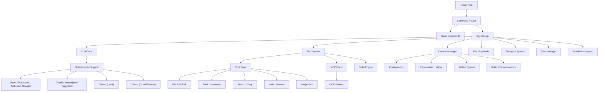
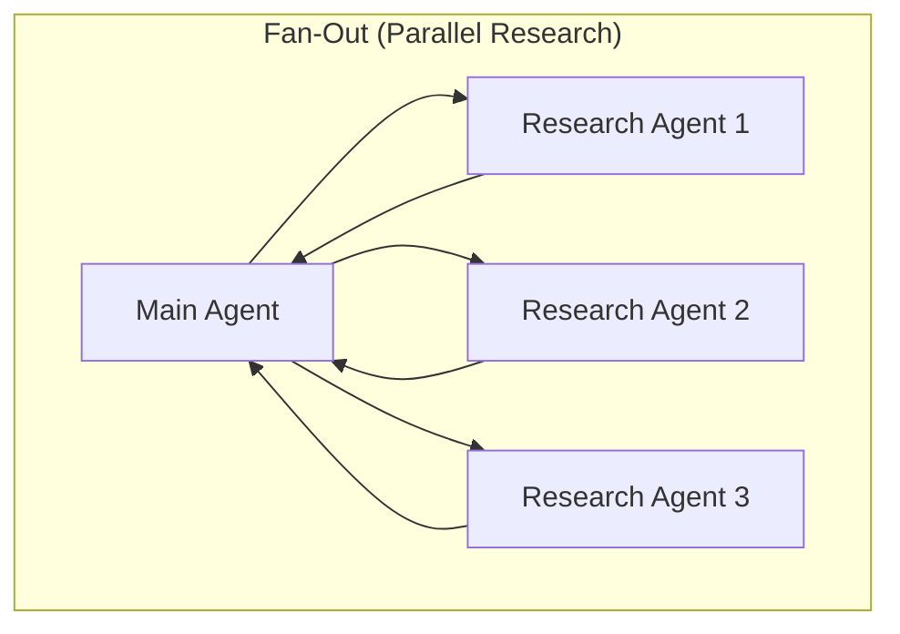
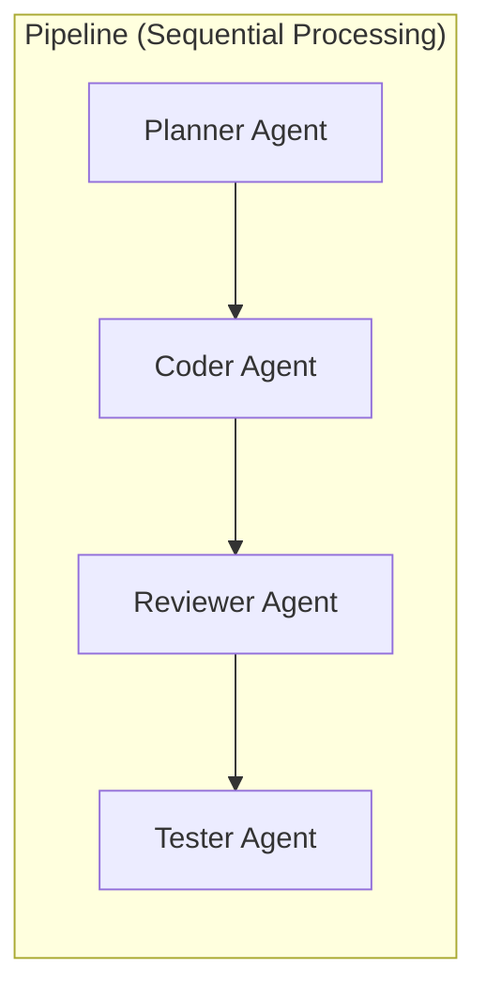
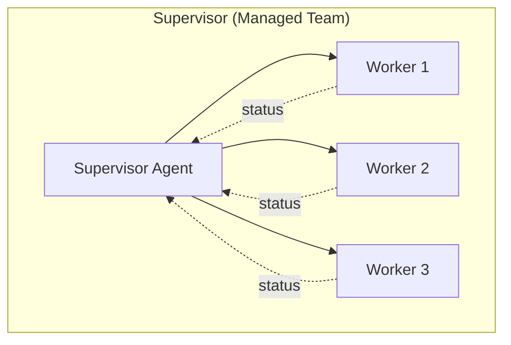

# Full-Featured Coding Agent Architecture

A complete breakdown of every system needed to build something like Antigravity, Cursor, or Claude Code — from MVP to production-grade.

---

## System Map (Bird's Eye View)



---

## 1. The Agent Loop (Core)

The beating heart. Everything else plugs into this.

```python
# Pseudocode — but this IS the real structure
while True:
    # 1. Build context (system prompt + history + active file info)
    context = context_manager.build(conversation, user_state)
    
    # 2. Gather available tools (core + MCP + skills)
    tools = tool_registry.get_active_tools()
    
    # 3. Call the LLM
    response = llm.chat(context, tools, stream=True)
    
    # 4. Handle response
    if response.tool_calls:
        for call in response.tool_calls:
            # Check permissions
            if not permissions.check(call):
                result = permissions.request(call)
            else:
                result = tool_executor.run(call)
            conversation.append(result)
        continue  # loop back to let model see results
    else:
        display(response.text)
        break  # wait for next user input
```

| Component | Est. Lines | Complexity |
|---|---|---|
| Agent loop + orchestration | 200-400 | Medium |
| Streaming response handler | 100-200 | Medium |
| Error recovery / retry logic | 100-150 | Medium |
| Token budget enforcement | 50-100 | Easy |

---

## 2. LLM Client (Multi-Provider)

Must support multiple providers with a unified interface. The provider layer is more nuanced than "just pick an API key" — there are **4 distinct connection modes** with very different tradeoffs.

### The 4 Provider Modes

#### Mode A: 🔑 Direct API (Standard)
```
Your Agent → API Key → OpenAI / Anthropic / Google endpoint
```
- You pay per token via your API key
- Most reliable, best rate limits, official support
- Simplest to implement: set `OPENAI_API_KEY` and go

#### Mode B: 🔓 OAuth / Subscription Piggyback (Gray Area)
```
Your Agent → OAuth browser login → ChatGPT Plus / Codex subscription → Uses your existing quota
```
This is what **Hermes**, **OpenClaw**, and similar tools do:
1. Open a browser window for OAuth login to your OpenAI account
2. Capture the session token / access token
3. Use the **internal ChatGPT API** (not the official developer API)
4. Requests count against your $20/mo subscription instead of per-token billing

```python
# How OAuth piggyback works under the hood:
# 1. User logs in via browser OAuth flow
# 2. Capture the access_token from the session cookie / response
# 3. Hit the internal API endpoints (not api.openai.com)

headers = {"Authorization": f"Bearer {access_token}"}
response = requests.post(
    "https://chat.openai.com/backend-api/conversation",  # internal API
    headers=headers,
    json=payload
)
```

> [!WARNING]
> **Gray area**: This violates OpenAI's ToS technically, and they can break it at any time by changing their internal API. But it works today and many open-source tools rely on it. The token also expires and needs periodic refresh.

#### Mode C: 🏠 Local Ollama
```
Your Agent → localhost:11434 → Ollama → Local Model (Qwen, Llama, etc.)
```
- Free, private, fully offline
- Limited by your GPU (VRAM determines which models fit)
- Ollama exposes an **OpenAI-compatible API** — almost zero extra code

#### Mode D: ☁️ Cloud / Remote Ollama
```
Your Agent → your-server.com:11434 → Ollama on a remote GPU box
```
- Same API as local Ollama, just different `base_url`
- Rent a GPU server (Vast.ai ~$0.50/hr, RunPod, Lambda Labs)
- Or self-host on a home server with a dedicated GPU
- Can run much larger models (70B+) than most local setups

### Cost Comparison

| Mode | Cost | Quality | Reliability | Tool Calling |
|---|---|---|---|---|
| OpenAI API (GPT-4o) | ~$2.50/1M tokens | ⭐⭐⭐⭐⭐ | ⭐⭐⭐⭐⭐ | ⭐⭐⭐⭐⭐ |
| Anthropic API (Claude) | ~$3/1M tokens | ⭐⭐⭐⭐⭐ | ⭐⭐⭐⭐⭐ | ⭐⭐⭐⭐⭐ |
| ChatGPT Plus OAuth | $20/mo flat | ⭐⭐⭐⭐⭐ | ⭐⭐⭐ (can break) | ⭐⭐⭐⭐ |
| Ollama Local (Qwen 14B) | Free | ⭐⭐⭐ | ⭐⭐⭐⭐⭐ | ⭐⭐⭐ |
| Ollama Cloud (Qwen 72B) | ~$0.50/hr server | ⭐⭐⭐⭐ | ⭐⭐⭐⭐ | ⭐⭐⭐⭐ |

> [!TIP]
> **Killer budget combo**: OAuth for complex tasks + local Ollama for simple ones, with direct API as a fallback.

### Configuration Example

```yaml
# config.yaml — all 4 modes in one config
providers:
  # --- Mode A: Direct API ---
  openai:
    type: api
    api_key: sk-...
    base_url: https://api.openai.com/v1
    models: [gpt-4o, gpt-4o-mini, o3]

  anthropic:
    type: api
    api_key: sk-ant-...
    models: [claude-sonnet-4, claude-opus-4]

  google:
    type: api
    api_key: AIza...
    models: [gemini-2.5-pro, gemini-2.5-flash]

  # --- Mode B: OAuth / Subscription Piggyback ---
  chatgpt-plus:
    type: oauth
    auth_url: https://chat.openai.com
    session_storage: ~/.agent/sessions/openai.json
    models: [gpt-4o, o3]  # whatever your subscription includes

  codex-sub:
    type: oauth
    auth_url: https://codex.openai.com
    session_storage: ~/.agent/sessions/codex.json
    models: [codex-mini]

  # --- Mode C: Local Ollama ---
  ollama-local:
    type: ollama
    base_url: http://localhost:11434
    models: [qwen2.5:14b, llama3.1:8b, deepseek-coder-v2:16b]

  # --- Mode D: Cloud / Remote Ollama ---
  ollama-cloud:
    type: ollama
    base_url: http://my-gpu-box.example.com:11434
    api_key: optional-auth-token  # if you set one up
    models: [qwen2.5:72b, llama3.3:70b]

# Default model to use
default_provider: chatgpt-plus
default_model: gpt-4o

# Fallback chain — if primary fails or rate-limited, try next
fallback_chain:
  - chatgpt-plus/gpt-4o       # free (subscription)
  - ollama-local/qwen2.5:14b  # free (local)
  - openai/gpt-4o-mini        # cheap API fallback
```

### The Clever Shortcut: Ollama is OpenAI-Compatible

Ollama exposes an OpenAI-compatible `/v1/chat/completions` endpoint, so local and cloud Ollama share ~90% of the code with the OpenAI provider:

```python
class OllamaProvider(OpenAICompatibleProvider):
    """Almost zero extra code — just a different base_url"""
    def __init__(self, base_url="http://localhost:11434"):
        super().__init__(
            base_url=f"{base_url}/v1",
            api_key="ollama"  # Ollama doesn't need a real key
        )
```

### File Structure

```
llm_client/
├── base.py               # Abstract LLMProvider interface
├── api_provider.py        # Standard OpenAI-compatible API (also used by Ollama)
├── anthropic_provider.py  # Anthropic (different message format)
├── google_provider.py     # Google Gemini
├── ollama_provider.py     # Local + Remote Ollama (subclass of api_provider)
├── oauth_provider.py      # OAuth / subscription piggyback
│   ├── browser_auth.py    # Opens browser, captures OAuth token
│   ├── session_manager.py # Stores, refreshes, validates tokens
│   └── chatgpt_api.py     # Internal ChatGPT API client (reverse-engineered)
├── router.py              # Routes model requests to the right provider
├── fallback.py            # Fallback chain logic (try next on failure)
├── token_counter.py       # Per-model tokenization (tiktoken, etc.)
└── rate_limiter.py        # Rate limiting + exponential backoff
```

### What it handles:
- **Provider abstraction** — unified interface across all 4 modes
- **Function calling format translation** — each provider formats tool schemas differently
- **Streaming** — SSE (OpenAI/Google) vs custom streaming (Anthropic)
- **Token counting** — tiktoken for OpenAI, different tokenizers per provider
- **Rate limiting & retries** — exponential backoff, quota management
- **Model selection & routing** — user picks model, client routes to right provider
- **Fallback chains** — automatic failover when a provider is down or rate-limited
- **Session management** — OAuth token storage, refresh, and validation

| Component | Est. Lines | Complexity |
|---|---|---|
| Provider abstraction + base | 150 | Medium |
| OpenAI-compatible provider | 200 | Medium |
| Anthropic provider | 200 | Medium |
| Google provider | 200 | Medium |
| Ollama provider (local + cloud) | 30 | **Trivial** (subclass) |
| OAuth provider + browser auth | 400-600 | **Hard** |
| Session manager (token storage/refresh) | 150 | Medium |
| Provider router + fallback chain | 150 | Medium |
| Token counting | 80 | Easy |
| Rate limiter | 80 | Easy |
| **Subtotal** | **~1,200-1,400** | |

---

## 3. Tool System

### 3a. Core Tools

These are the built-in tools every coding agent needs:

| Tool | What It Does | Lines | Hard Parts |
|---|---|---|---|
| `read_file` | View file with line ranges | 40 | Encoding detection, binary file handling |
| `write_file` | Create new files + directories | 50 | Overwrite protection, path validation |
| `edit_file` | Search & replace in files | 200 | **Fuzzy matching, indentation preservation, multi-edit coordination** |
| `list_dir` | Directory listing with metadata | 40 | Recursive size counting, ignore patterns |
| `grep_search` | Pattern search via ripgrep | 60 | Result capping, regex vs literal, includes/excludes |
| `run_command` | Execute shell commands | 150 | **Sandboxing, async/background, stdin, timeout** |
| `search_web` | Web search | 50 | API integration (Google, Brave, etc.) |
| `read_url` | Fetch & convert web pages | 60 | HTML→markdown conversion, JS rendering |
| `generate_image` | AI image generation | 40 | API integration |

> [!IMPORTANT]
> **`edit_file` is the hardest tool to get right.** It's where most coding agents break. Strategies:
> - Exact string matching (brittle but predictable)
> - Line-range based replacement (what I use)
> - Diff/patch application (flexible but error-prone)
> - Full file rewrite (expensive but reliable for small files)

### 3b. Tool Registry

The system that manages tool definitions, validates arguments, and routes calls:

```python
class ToolRegistry:
    def register(name, schema, handler, permissions_required)
    def get_active_tools() -> list[ToolDefinition]  # includes MCP + skills
    def execute(tool_call) -> ToolResult
    def validate_args(tool_call) -> bool
```

| Component | Est. Lines | Complexity |
|---|---|---|
| Core tools total | 700-900 | Medium-Hard |
| Tool registry + routing | 200 | Medium |
| Argument validation | 100 | Easy |

---

## 4. MCP Client

This lets your agent connect to external MCP servers and use their tools as if they were built-in.

### What it handles:
- **Server discovery** — find MCP servers from config
- **Connection management** — stdio or HTTP transport
- **Schema loading** — read tool schemas from servers (lazy vs eager)
- **Tool proxying** — translate agent tool calls → MCP protocol → server
- **Resource reading** — fetch data from MCP resources

```
mcp/
├── client.py           # MCP protocol client (JSON-RPC)
├── transport_stdio.py  # stdio-based transport
├── transport_http.py   # HTTP/SSE transport
├── server_manager.py   # Lifecycle management (start/stop servers)
├── schema_loader.py    # Load & cache tool schemas
├── tool_proxy.py       # Expose MCP tools to the agent
└── config.py           # Server configuration
```

### MCP Protocol Basics:
```json
// Tool call → MCP Server
{"jsonrpc": "2.0", "method": "tools/call", "params": {"name": "generate_image", "arguments": {"prompt": "a cat"}}}

// Response
{"jsonrpc": "2.0", "result": {"content": [{"type": "text", "text": "Image generated at /path/to/image.png"}]}}
```

| Component | Est. Lines | Complexity |
|---|---|---|
| MCP client + protocol | 300 | Medium |
| Transport layer (stdio + HTTP) | 200 | Medium |
| Server lifecycle management | 150 | Medium |
| Schema loading + caching | 100 | Easy |
| **Subtotal** | **~750** | |

---

## 5. Context Management

The brain's working memory. This is **critical** and often underestimated.

### What it manages:
- **System prompt construction** — assembling the base prompt with all context sections
- **Conversation history** — messages in, messages out, truncation when too long
- **Active file context** — what files the user has open, cursor position
- **User metadata** — OS, workspace path, settings
- **Token budgeting** — ensuring total context fits the model's window

### Context Assembly Order:
```
1. Identity / persona instructions
2. User information (OS, workspace, settings)
3. Available tools description
4. MCP server info
5. Skills catalog
6. Plugin catalog
7. Subagent catalog
8. Active rules (AGENTS.md)
9. Slash command catalog
10. Planning mode instructions
11. Communication style guidelines
12. Artifacts instructions
13. Conversation history (truncated to fit)
14. Current user message + file context
```

> [!WARNING]
> Context management is where **local models struggle most**. A 7B model with 8K context can't hold all of this. You need strategies:
> - Only include relevant sections
> - Summarize old conversation turns
> - Load skills/rules on-demand, not upfront
> - Use RAG for large codebases

| Component | Est. Lines | Complexity |
|---|---|---|
| System prompt builder | 200 | Medium |
| Conversation history manager | 150 | Medium |
| Token budget / truncation | 100 | Medium |
| User state tracking | 50 | Easy |
| **Subtotal** | **~500** | |

---

## 6. Configuration System

```
config/
├── config.py            # Main config loader
├── user_settings.py     # Model selection, API keys, preferences
├── workspace_config.py  # Per-project settings
└── defaults.py          # Sensible defaults
```

### Settings you need:
- **API keys** — per provider
- **Model selection** — which model to use, with fallbacks
- **Permission defaults** — what the agent can do without asking
- **Workspace root** — where the project lives
- **Ignore patterns** — files/dirs to skip (.git, node_modules, etc.)
- **Shell** — which shell to use (bash, powershell, zsh)
- **Custom instructions** — user-specific behavioral rules

| Component | Est. Lines | Complexity |
|---|---|---|
| Config system | 200-300 | Easy-Medium |

---

## 7. Slash Commands

User-facing shortcuts that trigger specialized behaviors.

### Implementation:
```python
class SlashCommand:
    name: str            # "/goal"
    description: str     # "Run a long-running task thoroughly"
    handler: Callable    # What to do when triggered

class CommandRouter:
    def parse(input: str) -> (SlashCommand | None, str)
    def execute(command, args) -> None
```

### Example commands:
| Command | What It Does | Implementation |
|---|---|---|
| `/goal` | Long-running task mode — agent doesn't stop until done | Modifies system prompt to be extra persistent |
| `/schedule` | Run something on a timer or cron | Creates a scheduler task |
| `/browser` | Web browsing mode | Launches browser tools + modified prompt |
| `/learn` | Persist a behavior as a rule | Writes to AGENTS.md or creates a skill |
| `/plan` | Force planning mode | Sets planning flag |
| `/compact` | Summarize & compress conversation | Triggers context summarization |
| `/help` | Show available commands | Lists all registered commands |

| Component | Est. Lines | Complexity |
|---|---|---|
| Command router | 80 | Easy |
| Each command handler | 30-100 each | Easy-Medium |
| **Subtotal** | **~300-500** | |

---

## 8. Skills System

Skills are **modular capability packages** the agent can discover and use.

### Structure:
```
skills/
├── skills.json              # Registry of skill locations
└── web-development/
    ├── SKILL.md             # Instructions (YAML frontmatter + markdown)
    ├── scripts/             # Helper scripts
    ├── examples/            # Reference implementations
    ├── resources/           # Templates, assets
    └── references/          # Extended documentation
```

### How it works:
1. **Discovery** — scan skill directories, parse SKILL.md frontmatter
2. **Trigger matching** — match user intent to skill name/description
3. **Loading** — when triggered, read SKILL.md instructions into context
4. **Execution** — agent follows the skill's instructions using its tools

```python
class Skill:
    name: str
    description: str
    trigger_patterns: list[str]
    instructions_path: str  # SKILL.md

class SkillEngine:
    def discover(roots: list[str]) -> list[Skill]
    def match(user_input: str) -> list[Skill]
    def load(skill: Skill) -> str  # returns instructions to inject into context
```

| Component | Est. Lines | Complexity |
|---|---|---|
| Skill discovery + parsing | 150 | Medium |
| Trigger matching | 100 | Medium |
| Skill loading + context injection | 80 | Easy |
| **Subtotal** | **~330** | |

---

## 9. Plugins

Bundles of skills + subagents + config. A layer on top of skills.

```
plugins/
└── my-plugin/
    ├── plugin.json       # Metadata, dependencies
    ├── skills/           # Skills this plugin provides
    └── agents/           # Subagent definitions
```

| Component | Est. Lines | Complexity |
|---|---|---|
| Plugin loader + manager | 150-200 | Medium |

---

## 10. Subagent System

Spawn child agents that run in parallel with their own context.

### What it handles:
- **Definition** — create new agent types with custom prompts and tools
- **Invocation** — launch agents with a task, get back a conversation ID
- **Messaging** — send/receive messages between agents
- **Workspace isolation** — branched or shared workspaces
- **Lifecycle** — track, kill, list active agents

```python
class SubagentManager:
    def define(name, system_prompt, tools, description)
    def invoke(type_name, prompt, workspace_mode) -> conversation_id
    def send_message(conversation_id, message)
    def receive_messages() -> list[Message]
    def kill(conversation_id)
    def list_active() -> list[AgentInfo]
```

> [!NOTE]
> This is one of the most **powerful** features but also the most complex. Each subagent is essentially a full agent instance running in its own conversation thread.

| Component | Est. Lines | Complexity |
|---|---|---|
| Subagent manager | 300 | Hard |
| Inter-agent messaging | 150 | Medium |
| Workspace branching | 200 | Hard |
| **Subtotal** | **~650** | |

---

## 11. Permission System

Granular control over what the agent can do.

```python
class Permission:
    action: str     # "read_file", "write_file", "command", "mcp"
    target: str     # "/path/to/dir", "git", "server/*"
    granted: bool

class PermissionManager:
    def check(tool_call) -> bool
    def request(tool_call) -> Permission  # ask user
    def grant(action, target)
    def list_grants() -> list[Permission]
```

| Component | Est. Lines | Complexity |
|---|---|---|
| Permission system | 200-300 | Medium |

---

## 12. Artifacts & Conversation Persistence

### Artifacts
Rich markdown documents for presenting structured output:

```python
class ArtifactManager:
    def create(filename, content, metadata)
    def update(filename, content)
    def get_path(conversation_id) -> str
```

### Conversation Logs
JSONL-based transcript for full history:

```python
class ConversationLogger:
    def log_step(step_index, source, type, content, tool_calls)
    def get_transcript(conversation_id) -> list[Step]
```

| Component | Est. Lines | Complexity |
|---|---|---|
| Artifact manager | 100 | Easy |
| Conversation persistence | 150 | Medium |
| Transcript reader | 100 | Easy |
| **Subtotal** | **~350** | |

---

## 13. Task Manager (Background Tasks)

Run commands asynchronously, track their status, send input.

```python
class TaskManager:
    def launch(command, cwd) -> task_id
    def status(task_id) -> TaskStatus
    def kill(task_id)
    def send_input(task_id, input_str)
    def list_active() -> list[Task]
```

| Component | Est. Lines | Complexity |
|---|---|---|
| Task manager | 200-300 | Medium |

---

## 14. Planning Mode

Structured workflow: Research → Plan → Review → Execute → Verify.

- Detects when a task is complex enough to warrant planning
- Creates `implementation_plan.md` artifact
- Blocks execution until user approves
- Tracks progress via `task.md`
- Produces `walkthrough.md` after completion

| Component | Est. Lines | Complexity |
|---|---|---|
| Planning mode controller | 150-200 | Medium |

---

## 15. Rules & Customizations

User-defined behavioral rules loaded from `AGENTS.md` files:

```
# Global rules
~/.config/agents/AGENTS.md

# Project rules  
./agents/AGENTS.md
```

| Component | Est. Lines | Complexity |
|---|---|---|
| Rules discovery + loading | 100 | Easy |

---

## Total Estimate

| System | Lines of Code | Complexity |
|---|---|---|
| Agent Loop | 400-500 | Medium |
| LLM Client (4 provider modes) | 1,200-1,400 | Medium-Hard |
| Core Tools | 700-900 | Medium-Hard |
| Tool Registry | 300 | Medium |
| MCP Client | 750 | Medium |
| Context Management | 500 | Medium |
| Configuration | 200-300 | Easy |
| Slash Commands | 300-500 | Easy-Medium |
| Skills System | 330 | Medium |
| Plugins | 150-200 | Medium |
| Subagent System | 650 | Hard |
| Permission System | 200-300 | Medium |
| Artifacts + Persistence | 350 | Medium |
| Task Manager | 200-300 | Medium |
| Planning Mode | 150-200 | Medium |
| Rules | 100 | Easy |
| CLI Interface | 300-500 | Medium |
| **TOTAL** | **~7,000 - 9,000** | |

---

## Phased Build Plan

### Phase 1: Walking (Weekend Project) — ~750 lines
- Agent loop
- Single LLM provider
- `read_file`, `write_file`, `edit_file`, `run_command`, `list_dir`, `grep`
- Basic CLI with streaming

**Result**: A working coding agent you can chat with in the terminal.

### Phase 2: Running (1-2 Weeks) — ~2,500 lines
- Multi-provider LLM support (Direct API + Ollama local/cloud)
- OAuth / subscription piggyback mode (ChatGPT Plus, Codex)
- Fallback chains (auto-switch provider on failure)
- Permission system
- Context management with truncation
- Slash commands (`/help`, `/compact`, `/plan`)
- Conversation persistence
- Background task management

**Result**: A reliable daily-driver coding tool that can use cloud APIs, your ChatGPT subscription, or a local model.

### Phase 3: Flying (2-4 Weeks) — ~5,000 lines
- MCP client (connect to external tools)
- Skills system
- Plugin architecture
- Configuration system with profiles
- Web search + URL reading
- Planning mode with artifacts

**Result**: Extensible platform, comparable to open-source agents.

### Phase 4: Orbit (Ongoing) — ~9,000+ lines
- Subagent system
- Workspace branching
- Advanced context management (RAG, embeddings)
- Browser automation
- Image generation integration
- IDE integration / LSP

**Result**: Full Antigravity / Cursor-class system.

---

> [!TIP]
> **The secret**: 80% of the value comes from Phase 1 (750 lines). Each subsequent phase has diminishing returns but makes the tool dramatically more polished and capable. Start with Phase 1, use it daily, and let your own pain points guide what to build next.

---
---

# Part 2: Gap Analysis & The System Prompt

## What We Have vs. What's Missing

### ✅ Covered in Part 1

| # | System | Status |
|---|---|---|
| 1 | Agent Loop | ✅ Detailed |
| 2 | LLM Client (4 provider modes) | ✅ Detailed |
| 3 | Core Tools | ✅ Detailed |
| 4 | Tool Registry | ✅ Detailed |
| 5 | MCP Client | ✅ Detailed |
| 6 | Context Management | ✅ Outlined |
| 7 | Configuration | ✅ Outlined |
| 8 | Slash Commands | ✅ Outlined |
| 9 | Skills System | ✅ Detailed |
| 10 | Plugins | ✅ Outlined |
| 11 | Subagent System | ✅ Detailed |
| 12 | Permission System | ✅ Outlined |
| 13 | Artifacts + Persistence | ✅ Outlined |
| 14 | Task Manager | ✅ Outlined |
| 15 | Planning Mode | ✅ Outlined |
| 16 | Rules / Customizations | ✅ Outlined |

### ❌ Missing — Needed for Viability

| # | System | Why It Matters |
|---|---|---|
| 17 | **System Prompt Architecture** | THE most important piece — the "brain" instructions assembled before every message |
| 18 | **Scheduling / Timers** | Cron jobs, one-shot reminders, async wakeups |
| 19 | **Git Integration** | Understanding diffs, branches, commits, blame |
| 20 | **Sandbox / Security** | Preventing the agent from `rm -rf /` or leaking secrets |
| 21 | **Lint / IDE Feedback Loop** | Getting compiler/lint errors and acting on them |
| 22 | **Conversation Memory** | Cross-session memory, learning from corrections |
| 23 | **Web / Browser Automation** | Full browser control, not just URL fetching |
| 24 | **Image Understanding** | Reading screenshots, diagrams, UI mockups |
| 25 | **Token Optimization** | Smart truncation, summarization, context compaction |

---

## 17. System Prompt Architecture (The "Main Instruction")

> **This is the answer to "do we add a main instruction it always reads before each message?"**
>
> **YES.** And it's not just one instruction — it's a **massive assembled document** built from ~14 different blocks, reconstructed before every single LLM call. This is arguably the most important part of the entire system.

### How It Works

Every time the agent loop calls the LLM, the system prompt is **dynamically assembled** from multiple sources:

```python
def build_system_prompt(user_state, workspace, config):
    """Assembled fresh before EVERY LLM call"""
    sections = []
    
    # 1. Identity — who am I?
    sections.append(load_identity())
    
    # 2. User information — OS, workspace, settings
    sections.append(build_user_info(user_state))
    
    # 3. MCP servers — what external tools are available
    sections.append(build_mcp_catalog(active_servers))
    
    # 4. Web development guidelines (if applicable)
    sections.append(load_web_dev_guidelines())
    
    # 5. Customization system docs — how skills/rules work
    sections.append(load_customization_docs())
    
    # 6. Skills catalog — available skills with triggers
    sections.append(build_skills_catalog(discovered_skills))
    
    # 7. Plugins catalog — installed plugin bundles
    sections.append(build_plugins_catalog(installed_plugins))
    
    # 8. Subagent catalog — available agent types
    sections.append(build_subagent_catalog(available_agents))
    
    # 9. Conversation transcript docs — how to read logs
    sections.append(load_transcript_docs())
    
    # 10. Artifacts docs — how to create/format artifacts
    sections.append(load_artifact_docs())
    
    # 11. Slash commands catalog
    sections.append(build_slash_commands_catalog())
    
    # 12. Planning mode instructions
    sections.append(load_planning_mode_docs())
    
    # 13. Rules (AGENTS.md — global + workspace)
    sections.append(load_rules(workspace))
    
    # 14. Communication style guidelines
    sections.append(load_communication_style())
    
    return "\n".join(sections)
```

### The 14 Blocks — What Each Contains

#### Block 1: `<identity>`
The agent's persona and core behavioral instructions.
```
You are [AgentName], a powerful agentic AI coding assistant.
You are pair programming with a USER to solve their coding task.
The USER will send you requests which you must always prioritize.
```
**Size**: ~200 tokens. **Source**: Hardcoded template.

#### Block 2: `<user_information>`
Dynamic info about the current user and environment.
```
The USER's OS version is windows.
Active workspace: C:\Users\...\my-project
App Data Directory: C:\Users\...\.agent
Conversation ID: abc-123-def
```
**Size**: ~100 tokens. **Source**: Runtime detection.

#### Block 3: `<mcp_servers>`
Catalog of all connected MCP servers and their tools.
```
# image-gen-server
Eager: generate_image, restyle_image
Lazy: upscale_image, analyze_image

# unity-bridge  
Lazy: unity_ping, unity_get_hierarchy, unity_create_object
```
**Size**: Variable (50-500 tokens). **Source**: MCP server discovery.

#### Block 4: `<web_application_development>`
Guidelines for building web apps — tech stack, design aesthetics, SEO.
```
Use HTML + JS + Vanilla CSS. Avoid TailwindCSS unless requested.
AESTHETICS ARE VERY IMPORTANT. Premium, modern designs.
Use rich colors, glassmorphism, micro-animations.
```
**Size**: ~800 tokens. **Source**: Hardcoded / configurable.

#### Block 5: `<customizations>`
Explains how skills and rules are discovered and created.
```
Skills are discovered from:
- Global: ~/.config/skills/
- Workspace: .agents/skills/
Rules are loaded from AGENTS.md files.
```
**Size**: ~600 tokens. **Source**: Hardcoded docs.

#### Block 6: `<skills>`
Auto-discovered skill catalog with names, descriptions, and file paths.
```
Available skills:
- finance-brp: Rigorous equity research...
- chapter-writing: Used when user asks to "write a chapter"...
- worldbuilding: Used when user asks to "create a location"...
```
**Size**: Variable (200-1000 tokens). **Source**: Skill directory scan.

#### Block 7: `<plugins>`
Installed plugins and what they expose.
```
# android-cli-plugin
Skills: android-cli
# story-skills
Skills: chapter-writing, character-management, plot-structure
```
**Size**: Variable (100-500 tokens). **Source**: Plugin directory scan.

#### Block 8: `<subagents>`
Available subagent types and how to use them.
```
Available subagents:
- research: Read-only tools for exploring codebase and web
- self: Inherits parent's full configuration
```
**Size**: ~300 tokens. **Source**: Subagent registry.

#### Block 9: `<conversation_transcript>`
Docs on how to read conversation logs (JSONL format, useful grep commands).
**Size**: ~400 tokens. **Source**: Hardcoded docs.

#### Block 10: `<artifacts>`
Docs on creating rich markdown artifacts, formatting rules, embedding images.
**Size**: ~800 tokens. **Source**: Hardcoded docs.

#### Block 11: `<slash_commands>`
Available user-facing shortcuts.
```
- /goal: Long-running thorough task mode
- /schedule: Recurring or one-time timer
- /browser: Web browsing mode
- /learn: Persist behavior as a rule
```
**Size**: ~200 tokens. **Source**: Slash command registry.

#### Block 12: `<planning_mode>`
Instructions for when and how to create implementation plans.
```
Stop and create a plan if the request requires:
- Major architectural changes
- Extensive research
- Significant decision making
```
**Size**: ~500 tokens. **Source**: Hardcoded / mode-dependent.

#### Block 13: `<guidelines>` (Rules from AGENTS.md)
User-defined rules loaded from config files.
```
- Maintain documentation integrity
- Use TypeScript for all new files
- Always run tests before committing
```
**Size**: Variable (50-500 tokens). **Source**: AGENTS.md files.

#### Block 14: `<communication_style>`
How to format responses, when to ask questions, link formatting.
```
Keep responses concise. Use github-style markdown.
Create clickable file links for all code references.
```
**Size**: ~200 tokens. **Source**: Hardcoded.

### Total System Prompt Size

| Block | Tokens (typical) |
|---|---|
| Identity | 200 |
| User info | 100 |
| MCP catalog | 50-500 |
| Web dev guidelines | 800 |
| Customization docs | 600 |
| Skills catalog | 200-1000 |
| Plugins catalog | 100-500 |
| Subagent catalog | 300 |
| Transcript docs | 400 |
| Artifact docs | 800 |
| Slash commands | 200 |
| Planning mode | 500 |
| Rules (AGENTS.md) | 50-500 |
| Communication style | 200 |
| **TOTAL** | **~4,500 - 6,600 tokens** |

> [!IMPORTANT]
> That's **4,500-6,600 tokens consumed BEFORE the conversation even starts**. This is why context window size matters so much, and why local models with 8K context struggle — half the window is eaten by the system prompt alone.

### System Prompt Assembly — Implementation

```python
class SystemPromptBuilder:
    """Assembles the system prompt from all sources"""
    
    def __init__(self, config, workspace):
        self.config = config
        self.workspace = workspace
        self.blocks = []
    
    def build(self, user_state) -> str:
        self.blocks = []
        
        # Static blocks (loaded once, cached)
        self._add("identity", self._load_template("identity.md"))
        self._add("user_information", self._build_user_info(user_state))
        self._add("web_application_development", self._load_template("web_dev.md"))
        self._add("customizations", self._load_template("customizations.md"))
        self._add("conversation_transcript", self._load_template("transcripts.md"))
        self._add("artifacts", self._load_template("artifacts.md"))
        self._add("communication_style", self._load_template("style.md"))
        
        # Dynamic blocks (rebuilt each call)
        self._add("mcp_servers", self._build_mcp_catalog())
        self._add("skills", self._build_skills_catalog())
        self._add("plugins", self._build_plugins_catalog())
        self._add("subagents", self._build_subagent_catalog())
        self._add("slash_commands", self._build_slash_commands())
        self._add("planning_mode", self._build_planning_mode())
        self._add("guidelines", self._load_rules())
        
        return self._assemble()
    
    def _add(self, tag, content):
        """Each block is wrapped in XML-style tags"""
        self.blocks.append(f"<{tag}>\n{content}\n</{tag}>")
    
    def _assemble(self) -> str:
        return "\n".join(self.blocks)
```

```
system_prompt/
├── builder.py              # Main assembler (~200 lines)
├── templates/              # Static instruction templates
│   ├── identity.md
│   ├── web_dev.md
│   ├── customizations.md
│   ├── transcripts.md
│   ├── artifacts.md
│   └── style.md
├── dynamic/                # Dynamic catalog builders
│   ├── mcp_catalog.py
│   ├── skills_catalog.py
│   ├── plugins_catalog.py
│   ├── subagent_catalog.py
│   └── slash_commands.py
└── rules_loader.py         # Loads AGENTS.md from global + workspace roots
```

| Component | Est. Lines | Complexity |
|---|---|---|
| Prompt builder + assembler | 200 | Medium |
| Static templates (markdown) | ~2,000 words total | Easy (just writing) |
| Dynamic catalog builders | 300 | Medium |
| Rules loader | 80 | Easy |
| **Subtotal** | **~580 code + templates** | |

### Per-Message Context Assembly

Beyond the system prompt, each message also gets **per-message context** injected:

```python
def build_message_context(user_message, user_state):
    """Added to each user message, not the system prompt"""
    context = []
    
    # What files the user has open in their editor
    if user_state.open_files:
        context.append(f"Open files: {user_state.open_files}")
    
    # Cursor position
    if user_state.cursor:
        context.append(f"Cursor at: {user_state.cursor.file}:{user_state.cursor.line}")
    
    # Selected text
    if user_state.selection:
        context.append(f"Selected text:\n{user_state.selection}")
    
    # Current local time
    context.append(f"Local time: {datetime.now().isoformat()}")
    
    # Active settings changes
    if user_state.settings_changed:
        context.append(f"Setting changed: {user_state.settings_changed}")
    
    # Conversation history summaries (for context)
    if recent_conversations:
        context.append(build_conversation_summaries(recent_conversations))
    
    return "\n".join(context)
```

---

## 18. Scheduling / Timers

Run tasks on schedules or set reminders for async work.

```python
class Scheduler:
    def set_timer(duration_secs, prompt) -> task_id      # one-shot
    def set_cron(expression, prompt, max_iters) -> task_id  # recurring
    def cancel(task_id)
    def list_active() -> list[ScheduledTask]
```

Use cases:
- Wait 60s then check if a build finished
- Poll deployment status every 5 minutes
- Remind the agent to follow up on a long-running task

| Component | Est. Lines | Complexity |
|---|---|---|
| Scheduler | 150-200 | Medium |

---

## 19. Git Integration

Understanding and working with version control.

```python
class GitIntegration:
    def status() -> GitStatus           # modified, staged, untracked files
    def diff(file=None) -> str          # show changes
    def log(n=10) -> list[Commit]       # recent commits
    def blame(file, line) -> BlameInfo  # who changed this line
    def branch_info() -> BranchInfo     # current branch, remotes
    def stash() / def stash_pop()       # save/restore work
```

This isn't exposed as a "tool" the model calls — it's **ambient context**. The agent can run `git` commands via `run_command`, but having structured git awareness lets it:
- Avoid editing files with uncommitted changes without warning
- Understand what branch it's on
- Include relevant diff context in its reasoning

| Component | Est. Lines | Complexity |
|---|---|---|
| Git integration | 200-300 | Medium |

---

## 20. Sandbox / Security

Preventing the agent from doing damage.

### Layers:
1. **Command allowlist/blocklist** — block `rm -rf`, `format`, `del /s`, etc.
2. **Path restrictions** — only allow file ops within workspace
3. **Network restrictions** — control outbound network access
4. **Confirmation gates** — require user approval for destructive actions
5. **Secret detection** — don't let the agent echo API keys or passwords

```python
class Sandbox:
    def check_command(cmd) -> (allowed: bool, reason: str)
    def check_file_access(path, mode) -> bool
    def check_network(url) -> bool
    def scrub_secrets(text) -> str  # redact API keys etc.
```

| Component | Est. Lines | Complexity |
|---|---|---|
| Sandbox / security | 300-400 | Hard |

---

## 21. Lint / IDE Feedback Loop

Getting compiler and linter errors and feeding them back to the model.

```
Agent edits file → Linter runs → Errors detected → Fed back to model → Model fixes
```

```python
class LintFeedback:
    def run_lint(file) -> list[LintError]
    def get_diagnostics(workspace) -> list[Diagnostic]  # from LSP
    def format_for_model(errors) -> str  # human-readable error summary
```

This creates a **self-healing loop** — the agent can fix its own mistakes if you feed lint results back into the conversation.

| Component | Est. Lines | Complexity |
|---|---|---|
| Lint feedback | 150-200 | Medium |

---

## 22. Conversation Memory (Cross-Session)

Remembering things across separate conversations.

### Approaches:
- **Recent conversation summaries** — title + summary of last N conversations, injected into context
- **Learned rules** — when user says `/learn`, persist a behavioral rule to AGENTS.md
- **Embeddings + RAG** — vector-search past conversations for relevant context (advanced)

```python
class Memory:
    def save_conversation_summary(conv_id, title, summary)
    def get_recent_summaries(n=5) -> list[ConversationSummary]
    def learn_rule(rule_text, scope="global"|"workspace")
    def search_past_conversations(query) -> list[RelevantContext]  # RAG
```

| Component | Est. Lines | Complexity |
|---|---|---|
| Basic memory (summaries + learn) | 150 | Easy-Medium |
| RAG-based memory | 400+ | Hard |

---

## 23. Web / Browser Automation

Beyond `read_url` (fetch + convert), full browser control:

```python
class BrowserAutomation:
    def navigate(url)
    def click(selector)
    def type(selector, text)
    def screenshot() -> image_path
    def get_text(selector) -> str
    def evaluate_js(script) -> result
```

Built on **Playwright** or **Puppeteer**. Can be exposed as an MCP server or built-in tools.

| Component | Est. Lines | Complexity |
|---|---|---|
| Browser automation | 300-500 | Medium-Hard |

---

## 24. Image Understanding

The ability to "see" — screenshots, diagrams, UI mockups.

- Send images as part of messages to multimodal models
- Take screenshots of running apps and feed them to the model
- Understand error screenshots, UI layouts, design mockups

```python
class ImageHandler:
    def encode_image(path) -> base64_str  # for API calls
    def take_screenshot(window=None) -> image_path
    def resize_for_context(path, max_tokens) -> image_path
```

| Component | Est. Lines | Complexity |
|---|---|---|
| Image handling | 100-150 | Easy |

> [!NOTE]
> This requires a **multimodal model** (GPT-4o, Claude, Gemini). Local models with vision (LLaVA, Qwen-VL) work but are much less capable.

---

## 25. Token Optimization

Smart strategies to fit more useful information in the context window.

### Strategies:
1. **Conversation truncation** — drop oldest messages when near limit
2. **Message summarization** — summarize old turns instead of dropping them
3. **Lazy loading** — only load skill/plugin docs when triggered, not upfront
4. **Tool result compression** — truncate long command outputs
5. **File content windowing** — only include relevant lines, not whole files
6. **Context compaction** (`/compact`) — user-triggered summarization of entire conversation

```python
class TokenOptimizer:
    def count_tokens(text, model) -> int
    def truncate_conversation(messages, budget) -> messages
    def summarize_old_messages(messages, keep_recent=5) -> messages
    def compress_tool_result(result, max_tokens=500) -> str
    def compact_conversation(messages) -> messages  # aggressive summarization
```

| Component | Est. Lines | Complexity |
|---|---|---|
| Token optimizer | 200-300 | Medium |

---

## Updated Total (All Systems — Parts 1 & 2)

| System | Lines of Code | Status |
|---|---|---|
| Agent Loop | 400-500 | ✅ Part 1 |
| LLM Client (4 modes) | 1,200-1,400 | ✅ Part 1 |
| Core Tools | 700-900 | ✅ Part 1 |
| Tool Registry | 300 | ✅ Part 1 |
| MCP Client | 750 | ✅ Part 1 |
| Context Management | 500 | ✅ Part 1 |
| Configuration | 200-300 | ✅ Part 1 |
| Slash Commands | 300-500 | ✅ Part 1 |
| Skills System | 330 | ✅ Part 1 |
| Plugins | 150-200 | ✅ Part 1 |
| Subagent System | 650 | ✅ Part 1 |
| Permission System | 200-300 | ✅ Part 1 |
| Artifacts + Persistence | 350 | ✅ Part 1 |
| Task Manager | 200-300 | ✅ Part 1 |
| Planning Mode | 150-200 | ✅ Part 1 |
| Rules | 100 | ✅ Part 1 |
| CLI Interface | 300-500 | ✅ Part 1 |
| System Prompt Architecture | 580 | ✅ Part 2 |
| Scheduling / Timers | 150-200 | ✅ Part 2 |
| Git Integration | 200-300 | ✅ Part 2 |
| Sandbox / Security | 300-400 | ✅ Part 2 |
| Lint / IDE Feedback | 150-200 | ✅ Part 2 |
| Conversation Memory | 150-400 | ✅ Part 2 |
| Web / Browser Automation | 300-500 | ✅ Part 2 |
| Image Understanding | 100-150 | ✅ Part 2 |
| Token Optimization | 200-300 | ✅ Part 2 |

---
---

# Part 3: Final Gaps — The "Invisible" Systems

These are the systems you don't think about until something breaks. They're not flashy, but they're the difference between a demo and a product.

## ❌ Still Missing After Parts 1 & 2

| # | System | Why You'll Regret Skipping It |
|---|---|---|
| 26 | **Error Handling & Recovery** | Model outputs garbage JSON, tool crashes, API is down — what now? |
| 27 | **Streaming Architecture** | Showing tokens as they arrive, not waiting 30 seconds for a wall of text |
| 28 | **Loop Control & Autonomy Limits** | Agent stuck in an infinite tool-call loop? Max iterations, stuck detection |
| 29 | **User Approval / Confirmation UX** | "I'm about to delete 47 files — OK?" The interactive approval flow |
| 30 | **Interactive Questions / Modals** | Presenting multiple-choice questions to clarify ambiguous requests |
| 31 | **Logging / Observability / Cost Tracking** | How much did that conversation cost? Why did the agent do that? |
| 32 | **Undo / Rollback** | Agent broke your code — how do you get back? |
| 33 | **Workspace Management** | Project detection, switching, default directories, multi-root workspaces |
| 34 | **Parallel Tool Execution** | Calling 3 tools at once instead of one-by-one (massive speed boost) |

---

## 26. Error Handling & Recovery

**This is the #1 thing that separates a toy from a tool.** Things WILL go wrong:

### Failure Modes

| What Breaks | How Often | What Happens |
|---|---|---|
| Model returns malformed JSON tool call | Common | Parse error, need to retry or ask model to fix |
| Model hallucinates a file path | Common | Tool returns "file not found", model should self-correct |
| API rate limit / timeout | Occasional | Need backoff + retry, or fallback to another provider |
| Tool execution crashes | Occasional | Need to catch, format error nicely, feed back to model |
| Model gets stuck in a loop | Rare | Repeating the same failed action, need circuit breaker |
| Model tries something dangerous | Rare | Caught by sandbox, denied, model informed why |
| Context window overflow | Occasional | Need to truncate/summarize mid-conversation |

### Implementation

```python
class ErrorHandler:
    def handle_malformed_tool_call(response) -> RetryStrategy:
        """Model gave invalid JSON — ask it to try again"""
        return RetryStrategy(
            inject_message="Your tool call had invalid JSON. Here's the error: {error}. Please try again.",
            max_retries=3
        )
    
    def handle_tool_error(tool_name, error) -> ToolResult:
        """Tool crashed — format error for the model to understand"""
        return ToolResult(
            success=False,
            output=f"Error executing {tool_name}: {error}\nPlease check your arguments and try again."
        )
    
    def handle_api_error(provider, error) -> ProviderAction:
        """API failed — retry, backoff, or failover"""
        if is_rate_limit(error):
            return ProviderAction.RETRY_WITH_BACKOFF
        elif is_timeout(error):
            return ProviderAction.RETRY_ONCE
        else:
            return ProviderAction.FAILOVER_TO_NEXT  # use fallback chain
    
    def handle_context_overflow(messages, budget) -> messages:
        """Too many tokens — emergency truncation"""
        return truncate_oldest_messages(messages, budget)
```

| Component | Est. Lines | Complexity |
|---|---|---|
| Error handler + recovery strategies | 250-350 | Medium-Hard |
| Retry logic + backoff | 100 | Medium |
| Error formatting for model | 80 | Easy |
| **Subtotal** | **~400-500** | |

---

## 27. Streaming Architecture

Without streaming, the user stares at a blank screen for 10-30 seconds. With streaming, they see tokens appear in real-time. **This is essential for UX.**

### What Needs to Stream

```
1. LLM text response    → tokens appear one-by-one in the CLI
2. Tool call detection   → as the model outputs a tool call, detect and parse it
3. Tool execution output → command output streams as it runs
4. Progress indicators   → "Reading file...", "Searching...", spinners
```

### Implementation

```python
class StreamingHandler:
    async def stream_response(response_stream):
        """Process tokens as they arrive"""
        buffer = ""
        for chunk in response_stream:
            if chunk.is_text:
                print(chunk.text, end="", flush=True)  # real-time display
                buffer += chunk.text
            elif chunk.is_tool_call_start:
                show_spinner(f"Calling {chunk.tool_name}...")
            elif chunk.is_tool_call_complete:
                result = await execute_tool(chunk.tool_call)
                display_tool_result(result)
        return buffer
    
    async def stream_command_output(process):
        """Stream stdout/stderr from a running command"""
        async for line in process.stdout:
            print(f"  │ {line}", end="")
            yield line
```

### Provider-Specific Streaming Formats

| Provider | Streaming Format | Parsing Difficulty |
|---|---|---|
| OpenAI | SSE (Server-Sent Events) with delta chunks | Easy |
| Anthropic | Custom event stream with content blocks | Medium |
| Google | SSE with candidates array | Easy |
| Ollama | Newline-delimited JSON | Easy |

| Component | Est. Lines | Complexity |
|---|---|---|
| Stream handler + display | 200 | Medium |
| Per-provider stream parsers | 150 | Medium |
| Progress indicators / spinners | 50 | Easy |
| **Subtotal** | **~400** | |

---

## 28. Loop Control & Autonomy Limits

The agent loop can run indefinitely — the model keeps calling tools and looping. You need **guardrails**:

### Controls

```python
class LoopController:
    max_iterations: int = 50          # hard cap per user message
    max_consecutive_errors: int = 3    # stop if 3 errors in a row
    max_tokens_per_turn: int = 100000  # budget cap per response cycle
    stuck_detection_window: int = 5    # check last N iterations for repetition
    
    def should_continue(iteration, history) -> (bool, reason):
        # 1. Hard iteration cap
        if iteration >= self.max_iterations:
            return False, "Max iterations reached"
        
        # 2. Consecutive error detection
        if count_recent_errors(history) >= self.max_consecutive_errors:
            return False, "Too many consecutive errors"
        
        # 3. Stuck detection — is the agent repeating itself?
        if is_repeating_actions(history, window=self.stuck_detection_window):
            return False, "Agent appears stuck in a loop"
        
        # 4. Token budget
        if total_tokens_used(history) >= self.max_tokens_per_turn:
            return False, "Token budget exceeded"
        
        return True, None
```

### /goal Mode Override

When the user runs `/goal`, these limits get relaxed:
- `max_iterations` → 200+
- `stuck_detection` → more lenient
- Agent is instructed to be extra persistent

| Component | Est. Lines | Complexity |
|---|---|---|
| Loop controller | 150-200 | Medium |
| Stuck detection | 100 | Medium |
| /goal mode overrides | 50 | Easy |
| **Subtotal** | **~300** | |

---

## 29. User Approval / Confirmation UX

The agent should ask permission before dangerous or significant actions.

### When to Ask

| Action | Requires Approval? |
|---|---|
| Reading a file | ❌ Never |
| Writing a new file | ⚠️ Depends on permissions |
| Editing an existing file | ⚠️ Depends on permissions |
| Running a shell command | ✅ Always (unless pre-approved) |
| Deleting files | ✅ Always |
| Running `npm install` / `pip install` | ✅ Always (network + code execution) |
| Making API calls | ✅ Always |

### Implementation

```python
class ApprovalManager:
    def request_approval(action, details) -> ApprovalResult:
        """Show the user what's about to happen and wait for Y/N"""
        print(f"\n⚡ {action}")
        print(f"   {details}")
        response = input("   [Y]es / [N]o / [A]lways allow: ")
        
        if response.lower() == 'a':
            permissions.grant(action)  # remember for future
            return ApprovalResult.APPROVED
        elif response.lower() == 'y':
            return ApprovalResult.APPROVED
        else:
            return ApprovalResult.DENIED
    
    def format_command_preview(command) -> str:
        """Show exactly what command will run, highlighted"""
        return syntax_highlight(command, language="bash")
```

| Component | Est. Lines | Complexity |
|---|---|---|
| Approval manager | 100-150 | Easy-Medium |
| Command preview formatting | 50 | Easy |
| **Subtotal** | **~150-200** | |

---

## 30. Interactive Questions / Modals

Sometimes the agent needs to **ask clarifying questions** with specific options — not just yes/no.

### Example

```
┌─────────────────────────────────────────────────┐
│  Which testing framework should I use?          │
│                                                 │
│  ● (Recommended) pytest - most popular Python   │
│  ○ unittest - built-in, no dependencies         │
│  ○ nose2 - unittest extension                   │
│  ○ [Write-in response...]                       │
│                                                 │
│  [Submit]  [Skip]                               │
└─────────────────────────────────────────────────┘
```

### Implementation

```python
class InteractiveQuestion:
    question: str
    options: list[str]
    is_multi_select: bool = False  # checkboxes vs radio buttons
    
    def ask(self) -> str | list[str]:
        print(f"\n❓ {self.question}\n")
        for i, opt in enumerate(self.options, 1):
            print(f"  {i}. {opt}")
        print(f"  {len(self.options) + 1}. Other (type your answer)")
        
        choice = input("\n  Your choice: ")
        return self._parse_choice(choice)
```

In a CLI, this is simple numbered menus. In a GUI/web client, these become proper modals with radio buttons.

| Component | Est. Lines | Complexity |
|---|---|---|
| Question system | 100-150 | Easy |

---

## 31. Logging / Observability / Cost Tracking

You need to **see what's happening** inside the agent — for debugging, cost control, and auditing.

### What to Log

```python
class AgentLogger:
    def log_llm_call(provider, model, input_tokens, output_tokens, cost, latency_ms)
    def log_tool_call(tool_name, args, result, duration_ms)
    def log_error(source, error, context)
    def log_permission_request(action, target, granted)
    
class CostTracker:
    def record(provider, model, input_tokens, output_tokens):
        cost = calculate_cost(provider, model, input_tokens, output_tokens)
        self.session_total += cost
        self.conversation_total += cost
    
    def get_summary() -> CostSummary:
        return CostSummary(
            this_conversation="$0.12",
            this_session="$0.47",
            today="$2.31",
            this_month="$18.90"
        )
```

### JSONL Transcript Logging

Every step of every conversation → append-only JSONL file:

```json
{"step": 1, "type": "USER_INPUT", "content": "Fix the login bug", "timestamp": "..."}
{"step": 2, "type": "MODEL_RESPONSE", "content": "I'll look at...", "tool_calls": [...], "tokens": {"in": 4200, "out": 380}}
{"step": 3, "type": "TOOL_RESULT", "tool": "read_file", "result": "...", "duration_ms": 12}
```

### Cost Display in CLI

```
─── Conversation Stats ────────────────────
  Tokens:  12,400 in / 3,200 out
  Cost:    $0.08
  Calls:   7 tool calls, 3 LLM rounds
  Time:    14.2s total
───────────────────────────────────────────
```

| Component | Est. Lines | Complexity |
|---|---|---|
| Agent logger | 150 | Easy-Medium |
| Cost tracker + pricing tables | 200 | Medium |
| JSONL transcript writer | 100 | Easy |
| Stats display | 50 | Easy |
| **Subtotal** | **~500** | |

---

## 32. Undo / Rollback

The agent WILL make mistakes. Users need a way to revert.

### Strategies

| Strategy | How | Pros | Cons |
|---|---|---|---|
| **Git-based** | Auto-commit before changes, `git revert` to undo | Works with existing git | Clutters git history |
| **Snapshot-based** | Copy files before editing, restore on undo | Simple, no git needed | Uses disk space |
| **Change log** | Track every edit as a reversible operation | Granular undo | Complex to implement |

### Recommended: Hybrid Approach

```python
class UndoManager:
    def checkpoint(label="auto"):
        """Save current state before agent makes changes"""
        if is_git_repo():
            git_stash_or_commit(f"[agent-checkpoint] {label}")
        else:
            snapshot_modified_files()
    
    def undo(steps=1):
        """Revert the last N agent operations"""
        if is_git_repo():
            git_revert_last(steps)
        else:
            restore_snapshots(steps)
    
    def list_checkpoints() -> list[Checkpoint]:
        """Show what can be undone"""
```

| Component | Est. Lines | Complexity |
|---|---|---|
| Undo manager | 200-300 | Medium |
| File snapshotting | 100 | Easy |
| Git-based undo | 100 | Medium |
| **Subtotal** | **~300-400** | |

---

## 33. Workspace Management

How the agent knows where it's working and what "the project" is.

### What It Handles

```python
class WorkspaceManager:
    def detect_workspace() -> Workspace:
        """Auto-detect project root from cwd"""
        # Look for: .git, package.json, Cargo.toml, pyproject.toml, etc.
    
    def get_default_project_dir() -> Path:
        """Where to create new projects if no workspace"""
        # e.g., ~/.agent/scratch/
    
    def set_workspace(path):
        """User explicitly sets workspace root"""
    
    def get_ignore_patterns() -> list[str]:
        """Load .gitignore + .agentignore patterns"""
        # Don't index node_modules, .git, __pycache__, etc.
    
    def get_project_info() -> ProjectInfo:
        """Detect project type, language, framework"""
        # Look at files to determine: "This is a Next.js TypeScript project"
```

### .agentignore

Like .gitignore but for the agent — files/dirs the agent should never read or index:

```
# .agentignore
node_modules/
.env
*.secret
dist/
coverage/
```

| Component | Est. Lines | Complexity |
|---|---|---|
| Workspace detection | 100-150 | Easy-Medium |
| Ignore pattern loading | 80 | Easy |
| Project type detection | 100 | Medium |
| **Subtotal** | **~300** | |

---

## 34. Parallel Tool Execution

When the model wants to call 3 independent tools at once, execute them **simultaneously** instead of sequentially.

### How It Works

The model's response can contain multiple tool calls. If they're independent:

```python
# Sequential (slow — 3 seconds)
result1 = read_file("src/app.py")        # 1s
result2 = read_file("src/utils.py")      # 1s  
result3 = grep_search("TODO", "src/")    # 1s

# Parallel (fast — 1 second)
results = await asyncio.gather(
    read_file("src/app.py"),
    read_file("src/utils.py"),
    grep_search("TODO", "src/")
)
```

### Dependency Detection

Not all tool calls can be parallel. If one tool's arguments depend on another's result, they must be sequential. The system needs to detect this:

```python
class ParallelExecutor:
    async def execute_tool_calls(calls: list[ToolCall]) -> list[ToolResult]:
        """Execute independent calls in parallel, dependent ones sequentially"""
        
        # All tool calls from a single model response are independent
        # (the model can't reference other calls' results within the same batch)
        # So we can always parallelize within a single response
        
        tasks = [execute_tool(call) for call in calls]
        return await asyncio.gather(*tasks)
```

> [!TIP]
> This is simpler than it sounds — within a single model response, all tool calls are **always independent** (the model can't reference results from sibling calls). So you can always parallelize them safely.

| Component | Est. Lines | Complexity |
|---|---|---|
| Parallel executor | 100-150 | Medium |
| Async tool wrappers | 100 | Medium |
| **Subtotal** | **~200-250** | |

---
---

# Final Grand Total — All 35 Systems (Parts 1-3)

| # | System | Lines of Code | Part |
|---|---|---|---|
| 1 | Agent Loop | 400-500 | Part 1 |
| 2 | LLM Client (4 provider modes) | 1,200-1,400 | Part 1 |
| 3 | Core Tools | 700-900 | Part 1 |
| 4 | Tool Registry | 300 | Part 1 |
| 5 | MCP Client | 750 | Part 1 |
| 6 | Context Management | 500 | Part 1 |
| 7 | Configuration | 200-300 | Part 1 |
| 8 | Slash Commands | 300-500 | Part 1 |
| 9 | Skills System | 330 | Part 1 |
| 10 | Plugins | 150-200 | Part 1 |
| 11 | Subagent System | 650 | Part 1 |
| 12 | Permission System | 200-300 | Part 1 |
| 13 | Artifacts + Persistence | 350 | Part 1 |
| 14 | Task Manager | 200-300 | Part 1 |
| 15 | Planning Mode | 150-200 | Part 1 |
| 16 | Rules / Customizations | 100 | Part 1 |
| 17 | CLI Interface | 300-500 | Part 1 |
| 18 | System Prompt Architecture | 580 | Part 2 |
| 19 | Scheduling / Timers | 150-200 | Part 2 |
| 20 | Git Integration | 200-300 | Part 2 |
| 21 | Sandbox / Security | 300-400 | Part 2 |
| 22 | Lint / IDE Feedback | 150-200 | Part 2 |
| 23 | Conversation Memory | 150-400 | Part 2 |
| 24 | Web / Browser Automation | 300-500 | Part 2 |
| 25 | Image Understanding | 100-150 | Part 2 |
| 26 | Token Optimization | 200-300 | Part 2 |
| 27 | Error Handling & Recovery | 400-500 | Part 3 |
| 28 | Streaming Architecture | 400 | Part 3 |
| 29 | Loop Control & Autonomy | 300 | Part 3 |
| 30 | User Approval / Confirmation | 150-200 | Part 3 |
| 31 | Interactive Questions | 100-150 | Part 3 |
| 32 | Logging / Observability / Cost | 500 | Part 3 |
| 33 | Undo / Rollback | 300-400 | Part 3 |
| 34 | Workspace Management | 300 | Part 3 |
| 35 | Parallel Tool Execution | 200-250 | Part 3 |
| | **Subtotal (Parts 1-3)** | **~11,000 - 15,000** | |

---
---

# Part 4: Competitive Parity — What Real Shipping Agents Have

These are features that **Cursor, Aider, Claude Code, and Copilot** actually ship. Without them you have a working agent; with them you have a **competitive** one.

## ❌ Still Missing

| # | System | Who Has It | Why It's a Differentiator |
|---|---|---|---|
| 36 | **Codebase Indexing / Repo Map** | Cursor, Aider | Agent "knows" the entire codebase structure without reading every file |
| 37 | **Dual-Model / Router Architecture** | Aider, Cursor | Cheap model for simple tasks, expensive model for hard ones |
| 38 | **Testing Loop** | Aider, Claude Code | Edit → Run Tests → Fix Failures → Repeat automatically |
| 39 | **Project Initialization (/init)** | Claude Code, Cursor | Scan project and create a context summary on first use |
| 40 | **Diff Display / Change Visualization** | All of them | Show exactly what changed after each edit, syntax-highlighted |
| 41 | **@ Mentions / Context References** | Cursor, Copilot | `@file.py` `@function` `@web` to explicitly add context |
| 42 | **Extension / API Layer** | Cursor, Copilot | REST/WebSocket API so IDEs and web UIs can connect |

---

## 36. Codebase Indexing / Repo Map

This is **Aider's secret weapon** and a core feature of Cursor. Instead of grepping blindly, the agent has a **structural map** of the entire codebase.

### What It Does

Scans every file in the project and extracts:
- Function/method signatures
- Class definitions
- Import/export relationships
- File-level summaries

Then compresses this into a **repo map** that fits in the context window:

```
# Repo Map (auto-generated)

## src/auth/
- login.py
  - class LoginHandler: handles user authentication
    - def authenticate(username, password) -> AuthResult
    - def refresh_token(token) -> Token
    - def logout(session_id) -> None
  - class OAuthProvider: OAuth2 integration
    - def get_authorization_url() -> str
    - def exchange_code(code) -> TokenPair

## src/api/
- routes.py
  - def setup_routes(app) -> None
  - @app.get("/users") -> list[User]
  - @app.post("/users") -> User
  - @app.delete("/users/{id}") -> None
```

### Implementation

```python
class CodebaseIndexer:
    def index(workspace_root) -> RepoMap:
        """Scan all files and extract structural information"""
        for file in walk_files(workspace_root, ignore=load_ignore_patterns()):
            if is_code_file(file):
                tree = parse_ast(file)  # language-specific AST parsing
                symbols = extract_symbols(tree)  # functions, classes, imports
                index.add(file, symbols)
        return index
    
    def get_repo_map(max_tokens=2000) -> str:
        """Compressed map that fits in context"""
        return format_map(self.index, budget=max_tokens)
    
    def find_relevant_files(query) -> list[str]:
        """Given a user query, find the most relevant files"""
        # Option A: keyword matching against symbol names
        # Option B: embedding similarity search (requires vector DB)
    
    def refresh(changed_files):
        """Incrementally update index when files change"""
```

### Approaches by Complexity

| Approach | How | Lines | Quality |
|---|---|---|---|
| **AST-based** (Aider) | Parse code with tree-sitter, extract signatures | 400-600 | ⭐⭐⭐⭐ |
| **Regex-based** | Pattern match function/class definitions | 200 | ⭐⭐ |
| **LLM-summarized** | Ask a cheap model to summarize each file | 100 | ⭐⭐⭐ (expensive) |
| **Embedding + Vector DB** (Cursor) | Embed chunks, vector search | 500+ | ⭐⭐⭐⭐⭐ |

> [!TIP]
> Start with **regex-based** (200 lines, covers 80% of use cases), then upgrade to tree-sitter AST parsing when you need precision. Cursor's embedding approach is most powerful but requires a vector database (ChromaDB, Qdrant, or similar).

| Component | Est. Lines | Complexity |
|---|---|---|
| File scanner + ignore patterns | 100 | Easy |
| Symbol extractor (regex or AST) | 200-400 | Medium-Hard |
| Repo map formatter | 100 | Medium |
| Incremental refresh | 100 | Medium |
| Vector search (optional) | 300+ | Hard |
| **Subtotal** | **~500-1000** | |

---

## 37. Dual-Model / Router Architecture

Use different models for different tasks — don't burn expensive tokens on trivial operations.

### The Pattern

```
User message → Complexity Assessment → Route to appropriate model

Simple task ("rename this variable")  → cheap/fast model (GPT-4o-mini, Qwen 7B)
Complex task ("refactor auth system") → powerful model (Claude Opus, GPT-4o)
Code generation                       → code-specialized model (Codex, DeepSeek Coder)
Planning / architecture               → reasoning model (o3, Claude thinking)
```

### Aider's "Architect Mode"

Aider uses TWO models in sequence:
1. **Architect model** (expensive): Plans what changes to make, which files to edit
2. **Editor model** (cheap): Executes the actual file edits based on the plan

This is clever because the expensive reasoning only runs once, and the cheap model handles the mechanical editing.

### Implementation

```python
class ModelRouter:
    def route(user_message, conversation_context) -> ModelConfig:
        """Decide which model to use for this request"""
        
        complexity = assess_complexity(user_message)
        task_type = classify_task(user_message)  # edit, explain, plan, debug
        
        if complexity == "simple" and task_type == "edit":
            return ModelConfig(model="gpt-4o-mini", reason="simple edit")
        elif task_type == "plan":
            return ModelConfig(model="o3", reason="planning requires reasoning")
        elif task_type == "explain":
            return ModelConfig(model="gpt-4o-mini", reason="explanation is straightforward")
        else:
            return ModelConfig(model=config.default_model)
    
    def assess_complexity(message) -> str:
        """Quick heuristic — can also use a small classifier model"""
        # Heuristics: message length, keyword detection, file count mentioned
        if len(message) < 50 and any(w in message for w in ["rename", "fix typo", "add comment"]):
            return "simple"
        return "complex"

class ArchitectMode:
    def run(user_request):
        # Step 1: Plan with expensive model
        plan = architect_model.chat("Plan the changes needed: " + user_request)
        
        # Step 2: Execute with cheap model  
        for edit in plan.edits:
            editor_model.chat(f"Make this edit to {edit.file}: {edit.description}")
```

| Component | Est. Lines | Complexity |
|---|---|---|
| Model router + complexity assessment | 150-200 | Medium |
| Architect mode (dual-model pipeline) | 150 | Medium |
| Task classifier | 100 | Medium |
| **Subtotal** | **~400-450** | |

---

## 38. Testing Loop

A specific agentic loop pattern: **Edit → Run Tests → Fix Failures → Repeat**.

### How It Works

```python
class TestingLoop:
    max_fix_attempts: int = 5
    
    async def edit_and_verify(edit_plan):
        """Make edits, then verify they don't break tests"""
        
        # 1. Make the edits
        apply_edits(edit_plan)
        
        # 2. Run tests
        for attempt in range(self.max_fix_attempts):
            result = run_tests(workspace)
            
            if result.all_passed:
                return Success(f"All {result.total} tests passed")
            
            # 3. Feed failures back to the model
            fix_prompt = f"""
            {result.failed_count} tests failed after your edit.
            
            Failures:
            {format_test_failures(result.failures)}
            
            Please fix the code to make these tests pass.
            """
            
            # 4. Model generates fixes
            fixes = await model.chat(fix_prompt)
            apply_edits(fixes)
        
        return Failure("Could not fix all tests after {max_fix_attempts} attempts")
    
    def detect_test_command(workspace) -> str:
        """Auto-detect how to run tests"""
        if exists("pytest.ini") or exists("pyproject.toml"):
            return "pytest"
        elif exists("package.json"):
            pkg = read_json("package.json")
            if "test" in pkg.get("scripts", {}):
                return "npm test"
        elif exists("Cargo.toml"):
            return "cargo test"
        return None  # ask user
    
    def parse_test_output(output, framework) -> TestResult:
        """Parse test runner output into structured results"""
        # Framework-specific parsers for pytest, jest, cargo test, etc.
```

| Component | Est. Lines | Complexity |
|---|---|---|
| Testing loop controller | 150 | Medium |
| Test command detection | 80 | Easy |
| Test output parsers (per framework) | 150-300 | Medium |
| **Subtotal** | **~400-500** | |

---

## 39. Project Initialization (/init)

When the agent first encounters a project, scan it and create a persistent context file.

### What /init Does

1. Scans the project structure
2. Identifies language, framework, build system
3. Reads README, config files, existing docs
4. Generates a `.agent/project_context.md` summary
5. Stores it so future conversations start with project awareness

```python
class ProjectInitializer:
    def init(workspace) -> ProjectContext:
        """Scan and summarize the project"""
        context = ProjectContext()
        
        # Detect basics
        context.languages = detect_languages(workspace)
        context.framework = detect_framework(workspace)
        context.build_system = detect_build_system(workspace)
        context.package_manager = detect_package_manager(workspace)
        
        # Read key files
        if exists("README.md"):
            context.readme_summary = summarize(read("README.md"))
        if exists("package.json"):
            context.dependencies = parse_dependencies("package.json")
        
        # Generate repo map
        context.repo_map = indexer.get_repo_map()
        
        # Write persistent context
        write(f"{workspace}/.agent/project_context.md", context.to_markdown())
        
        return context
```

### Generated Output Example

```markdown
# Project Context (auto-generated by /init)

**Type**: Next.js 14 web application (TypeScript)
**Package Manager**: pnpm
**Test Framework**: Jest + React Testing Library
**Linter**: ESLint + Prettier
**Key Dependencies**: React 18, Prisma ORM, NextAuth.js

## Structure
- `src/app/` — App router pages
- `src/components/` — React components (47 files)
- `src/lib/` — Utilities and helpers
- `prisma/` — Database schema and migrations

## Conventions
- Components use PascalCase
- API routes in `src/app/api/`
- Environment vars in `.env.local`
```

| Component | Est. Lines | Complexity |
|---|---|---|
| Project scanner + detectors | 200 | Medium |
| Context file generator | 100 | Easy |
| **Subtotal** | **~300** | |

---

## 40. Diff Display / Change Visualization

After every file edit, show the user **exactly what changed** with syntax-highlighted diffs.

### What It Looks Like in CLI

```diff
── Modified: src/auth/login.py ──────────────────
@@ -42,7 +42,9 @@
  def authenticate(username, password):
-     user = db.find_user(username)
-     if user and check_password(password, user.hash):
+     user = db.find_user(username.lower().strip())
+     if not user:
+         raise AuthError("User not found")
+     if check_password(password, user.password_hash):
          return create_session(user)
──────────────────────────────────────────────────
```

### Implementation

```python
class DiffDisplay:
    def show_edit_diff(file_path, old_content, new_content):
        """Generate and display a syntax-highlighted diff"""
        diff_lines = unified_diff(
            old_content.splitlines(),
            new_content.splitlines(),
            fromfile=f"a/{basename(file_path)}",
            tofile=f"b/{basename(file_path)}",
            lineterm=""
        )
        
        for line in diff_lines:
            if line.startswith("+"):
                print(colorize(line, "green"))
            elif line.startswith("-"):
                print(colorize(line, "red"))
            else:
                print(line)
    
    def show_file_created(file_path, content):
        """Show new file creation with full content highlighted"""
    
    def show_file_deleted(file_path):
        """Show file deletion warning"""
```

| Component | Est. Lines | Complexity |
|---|---|---|
| Diff generator | 80 | Easy |
| Syntax-highlighted diff display | 100 | Medium |
| Created/deleted file display | 50 | Easy |
| **Subtotal** | **~230** | |

---

## 41. @ Mentions / Context References

Let users **explicitly inject context** into the conversation with `@` syntax.

### Supported Mentions

| Syntax | What It Does |
|---|---|
| `@file.py` | Adds the full file contents to context |
| `@src/auth/` | Adds all files in a directory |
| `@LoginHandler` | Searches for and adds the class/function definition |
| `@web "react hooks"` | Searches the web and injects results |
| `@git diff` | Adds current git diff to context |
| `@terminal` | Adds recent terminal output |
| `@image screenshot.png` | Adds an image to the message |
| `@docs react.dev` | Fetches and injects documentation |

### Implementation

```python
class MentionParser:
    def parse(user_message) -> (clean_message, list[ContextInjection]):
        """Extract @ mentions and resolve them to context"""
        mentions = re.findall(r'@(\S+)', user_message)
        injections = []
        
        for mention in mentions:
            if is_file(mention):
                injections.append(FileInjection(mention))
            elif is_directory(mention):
                injections.append(DirectoryInjection(mention))
            elif mention == "web":
                query = extract_query_after(mention)
                injections.append(WebSearchInjection(query))
            elif mention == "git":
                injections.append(GitDiffInjection())
            elif is_symbol(mention):
                injections.append(SymbolLookupInjection(mention))
        
        clean = re.sub(r'@\S+', '', user_message).strip()
        return clean, injections
    
    def resolve(injections) -> str:
        """Resolve all mentions to actual content"""
        context_parts = []
        for inj in injections:
            content = inj.resolve()
            context_parts.append(f"--- {inj.label} ---\n{content}")
        return "\n\n".join(context_parts)
```

| Component | Est. Lines | Complexity |
|---|---|---|
| Mention parser | 100 | Easy-Medium |
| File/directory resolver | 60 | Easy |
| Symbol lookup resolver | 100 | Medium |
| Web/git/terminal resolvers | 80 | Easy |
| **Subtotal** | **~340** | |

---

## 42. Extension / API Layer

If you ever want to go beyond CLI — connect to **VS Code, a web UI, Neovim, or a mobile app** — you need an API layer.

### Architecture

```
┌─────────────┐     ┌─────────────┐     ┌─────────────┐
│  CLI Client  │     │  VS Code    │     │  Web UI     │
│  (terminal)  │     │  Extension  │     │  (React)    │
└──────┬───────┘     └──────┬───────┘     └──────┬───────┘
       │                    │                    │
       └────────────┬───────┴────────────────────┘
                    │
            ┌───────▼────────┐
            │  Agent API     │
            │  (REST/WS)     │
            │                │
            │  POST /chat    │
            │  WS  /stream   │
            │  GET  /status  │
            │  POST /approve │
            └───────┬────────┘
                    │
            ┌───────▼────────┐
            │  Agent Core    │
            │  (all 41       │
            │   systems)     │
            └────────────────┘
```

### API Endpoints

```python
# REST + WebSocket API
class AgentAPI:
    # Core conversation
    @app.post("/api/chat")
    async def send_message(message: str, conversation_id: str) -> StreamingResponse
    
    @app.websocket("/api/stream/{conversation_id}")
    async def stream(websocket): ...  # real-time streaming via WebSocket
    
    # Tool approval
    @app.post("/api/approve/{tool_call_id}")
    async def approve_tool(approved: bool) -> None
    
    # Conversation management
    @app.get("/api/conversations")
    async def list_conversations() -> list[Conversation]
    
    @app.get("/api/conversations/{id}/history")
    async def get_history(id: str) -> list[Message]
    
    # Configuration
    @app.get("/api/config")
    async def get_config() -> Config
    
    @app.put("/api/config")
    async def update_config(config: Config) -> None
    
    # Status
    @app.get("/api/status")
    async def get_status() -> AgentStatus  # active model, token usage, etc.
```

> [!NOTE]
> This is what turns your CLI agent into a **platform**. The CLI becomes just one client. You could build a VS Code extension, an Electron app, a web dashboard, or even a mobile companion app — all talking to the same agent core.

| Component | Est. Lines | Complexity |
|---|---|---|
| HTTP server (FastAPI/Flask) | 200 | Medium |
| WebSocket streaming | 150 | Medium |
| API routes | 200 | Medium |
| Client abstraction (CLI ↔ API) | 150 | Medium |
| **Subtotal** | **~700** | |

---
---

# True Final Grand Total — All 42 Systems

| # | System | Lines | Part |
|---|---|---|---|
| 1 | Agent Loop | 400-500 | 1 |
| 2 | LLM Client (4 provider modes) | 1,200-1,400 | 1 |
| 3 | Core Tools | 700-900 | 1 |
| 4 | Tool Registry | 300 | 1 |
| 5 | MCP Client | 750 | 1 |
| 6 | Context Management | 500 | 1 |
| 7 | Configuration | 200-300 | 1 |
| 8 | Slash Commands | 300-500 | 1 |
| 9 | Skills System | 330 | 1 |
| 10 | Plugins | 150-200 | 1 |
| 11 | Subagent System | 650 | 1 |
| 12 | Permission System | 200-300 | 1 |
| 13 | Artifacts + Persistence | 350 | 1 |
| 14 | Task Manager | 200-300 | 1 |
| 15 | Planning Mode | 150-200 | 1 |
| 16 | Rules / Customizations | 100 | 1 |
| 17 | CLI Interface | 300-500 | 1 |
| 18 | System Prompt Architecture | 580 | 2 |
| 19 | Scheduling / Timers | 150-200 | 2 |
| 20 | Git Integration | 200-300 | 2 |
| 21 | Sandbox / Security | 300-400 | 2 |
| 22 | Lint / IDE Feedback | 150-200 | 2 |
| 23 | Conversation Memory | 150-400 | 2 |
| 24 | Web / Browser Automation | 300-500 | 2 |
| 25 | Image Understanding | 100-150 | 2 |
| 26 | Token Optimization | 200-300 | 2 |
| 27 | Error Handling & Recovery | 400-500 | 3 |
| 28 | Streaming Architecture | 400 | 3 |
| 29 | Loop Control & Autonomy | 300 | 3 |
| 30 | User Approval / Confirmation | 150-200 | 3 |
| 31 | Interactive Questions | 100-150 | 3 |
| 32 | Logging / Observability / Cost | 500 | 3 |
| 33 | Undo / Rollback | 300-400 | 3 |
| 34 | Workspace Management | 300 | 3 |
| 35 | Parallel Tool Execution | 200-250 | 3 |
| 36 | Codebase Indexing / Repo Map | 500-1000 | 4 |
| 37 | Dual-Model / Router | 400-450 | 4 |
| 38 | Testing Loop | 400-500 | 4 |
| 39 | Project Init (/init) | 300 | 4 |
| 40 | Diff Display | 230 | 4 |
| 41 | @ Mentions | 340 | 4 |
| 42 | Extension / API Layer | 700 | 4 |
| | **Subtotal (Parts 1-4)** | **~13,000 - 18,000** | |

---
---

# Part 5: Your App — Settings, Smart Context, Orchestration & Subagent Depth

These are the systems that make it feel like **your** app — not a generic wrapper around an LLM.

## ❌ Gaps Identified

| # | System | What's Missing |
|---|---|---|
| 43 | **Internal Settings & Preferences** | User-facing settings UI, model switching, verbosity, budgets |
| 44 | **Advanced Context Management** | 5 context modes, auto/manual compaction, smart relevance scoring |
| 45 | **Task Orchestration Engine** | Multi-step workflow coordination, conditional branching, delegation |
| 46 | **Advanced Subagent Patterns** | Agent types, communication topologies, result aggregation |

---

## 43. Internal Settings & Preferences

Not just a config file — a **live settings system** the user interacts with during use.

### /settings Command

```
$ /settings

┌─── Agent Settings ─────────────────────────────────────────┐
│                                                            │
│  🤖 Model                                                  │
│  ├─ Active model:     claude-sonnet-4                      │
│  ├─ Provider:         anthropic (API)                      │
│  ├─ Fallback chain:   anthropic → ollama-local → openai    │
│  └─ [Change model...]                                      │
│                                                            │
│  📊 Context                                                │
│  ├─ Mode:             adaptive (auto-compact)              │
│  ├─ Context window:   200K tokens                          │
│  ├─ Used:             34,200 / 200,000 (17%)               │
│  └─ Auto-compact at:  80%                                  │
│                                                            │
│  💰 Budget                                                 │
│  ├─ Session cost:     $0.47                                │
│  ├─ Daily limit:      $10.00                               │
│  ├─ Monthly limit:    $50.00                               │
│  └─ Warn at:          80% of limit                         │
│                                                            │
│  🔒 Permissions                                            │
│  ├─ Auto-approve:     file reads, grep                     │
│  ├─ Ask first:        file writes, commands                │
│  ├─ Always block:     rm -rf, format, del /s               │
│  └─ [Manage permissions...]                                │
│                                                            │
│  🎨 Display                                                │
│  ├─ Verbosity:        normal (compact | normal | verbose)  │
│  ├─ Show diffs:       yes                                  │
│  ├─ Show token count: yes                                  │
│  ├─ Show cost:        yes                                  │
│  ├─ Theme:            dark                                 │
│  └─ Markdown render:  enabled                              │
│                                                            │
│  ⚡ Behavior                                               │
│  ├─ Planning mode:    auto (auto | always | never)         │
│  ├─ Max iterations:   50 (per message)                     │
│  ├─ Auto-test:        off (run tests after edits)          │
│  ├─ Auto-lint:        on (check lint after edits)          │
│  └─ Confirm commands: yes                                  │
│                                                            │
└────────────────────────────────────────────────────────────┘
```

### Live Settings Changes

The user can change settings **mid-conversation** without restarting:

```
> /model claude-opus-4          # switch model instantly
> /model ollama qwen2.5:14b     # switch to local
> /verbose                       # increase verbosity
> /compact-mode                  # switch to lean context
> /budget $5                     # set daily spending limit
> /auto-approve writes           # stop asking about file writes
```

### Implementation

```python
class SettingsManager:
    def __init__(self):
        self.settings = self._load_persisted()  # from config file
        self._defaults = self._load_defaults()
    
    # --- Model Settings ---
    model: str = "claude-sonnet-4"
    provider: str = "anthropic"
    fallback_chain: list[str] = ["anthropic/claude-sonnet-4", "ollama/qwen2.5:14b"]
    
    # --- Context Settings ---
    context_mode: str = "adaptive"         # full | lean | auto-compact | adaptive
    auto_compact_threshold: float = 0.8    # compact at 80% of context window
    max_context_for_repo_map: int = 2000   # tokens budget for repo map
    
    # --- Budget Settings ---
    daily_budget: float = 10.0             # $10/day
    monthly_budget: float = 50.0           # $50/month
    budget_warn_threshold: float = 0.8     # warn at 80%
    
    # --- Permission Settings ---
    auto_approve: set = {"read_file", "list_dir", "grep_search"}
    always_ask: set = {"write_file", "run_command"}
    always_block: set = {"rm -rf", "format C:", "del /s /q"}
    
    # --- Display Settings ---
    verbosity: str = "normal"              # compact | normal | verbose
    show_diffs: bool = True
    show_token_count: bool = True
    show_cost: bool = True
    theme: str = "dark"
    render_markdown: bool = True
    
    # --- Behavior Settings ---
    planning_mode: str = "auto"            # auto | always | never
    max_iterations: int = 50
    auto_test_after_edit: bool = False
    auto_lint_after_edit: bool = True
    confirm_commands: bool = True
    
    # --- Persistence ---
    def save(self):
        """Persist to ~/.agent/settings.yaml"""
        write_yaml(self.settings_path, self.to_dict())
    
    def update(self, key, value):
        """Update a setting and notify the system"""
        setattr(self, key, value)
        self.save()
        self._notify_change(key, value)  # other systems may need to react
    
    def reset(self, key=None):
        """Reset to defaults"""
        if key:
            setattr(self, key, self._defaults[key])
        else:
            self.settings = copy(self._defaults)
        self.save()
```

### Settings Persistence

```yaml
# ~/.agent/settings.yaml — auto-saved, user-editable
model:
  active: claude-sonnet-4
  provider: anthropic
  fallback_chain:
    - anthropic/claude-sonnet-4
    - ollama-local/qwen2.5:14b
    - openai/gpt-4o-mini

context:
  mode: adaptive
  auto_compact_threshold: 0.8

budget:
  daily: 10.0
  monthly: 50.0
  warn_at: 0.8

display:
  verbosity: normal
  show_diffs: true
  show_cost: true
  theme: dark

behavior:
  planning_mode: auto
  max_iterations: 50
  auto_test: false
  auto_lint: true
  confirm_commands: true

permissions:
  auto_approve: [read_file, list_dir, grep_search]
  always_block: ["rm -rf", "format", "del /s"]
```

| Component | Est. Lines | Complexity |
|---|---|---|
| Settings manager + persistence | 250 | Medium |
| /settings display (CLI rendering) | 100 | Easy-Medium |
| Live setting change commands | 100 | Easy |
| Settings notification bus | 50 | Easy |
| **Subtotal** | **~500** | |

---

## 44. Advanced Context Management

Not just "truncate old messages" — a full **context intelligence system** with multiple modes.

### The 5 Context Modes

| Mode | How It Works | When to Use |
|---|---|---|
| **Full** | Load everything — all system prompt blocks, full history, repo map | Large context models (200K+), complex tasks |
| **Lean** | Minimal system prompt, no repo map, only last 5 messages | Small local models (8K-32K context) |
| **Auto-Compact** | Automatically compress when hitting threshold (e.g. 80%) | Default for most users |
| **Manual Compact** | User triggers `/compact` to summarize and reset | When context feels bloated |
| **Adaptive** | Dynamically adjust based on model's context window and task complexity | Smartest mode, recommended default |

### Auto-Compact: How It Works

```python
class AutoCompactor:
    threshold: float = 0.8  # trigger at 80% of context window
    
    def check_and_compact(messages, model_context_limit):
        used = count_tokens(messages)
        limit = model_context_limit
        
        if used / limit > self.threshold:
            return self.compact(messages)
        return messages
    
    def compact(messages):
        """Summarize old messages, keep recent ones intact"""
        # Split: old messages (to summarize) | recent messages (to keep)
        split_point = find_split_point(messages, keep_recent=5)
        
        old_messages = messages[:split_point]
        recent_messages = messages[split_point:]
        
        # Summarize old messages using a cheap/fast model
        summary = cheap_model.chat(
            f"Summarize this conversation concisely, preserving key decisions, "
            f"file changes made, and important context:\n\n{format_messages(old_messages)}"
        )
        
        # Replace old messages with summary
        compacted = [
            SystemMessage(f"[Conversation Summary]\n{summary}"),
            *recent_messages
        ]
        
        return compacted
```

### Manual Compact (/compact)

```
> /compact

─── Context Compaction ────────────────────────
  Before: 147,200 tokens (73% of 200K)
  
  Summarizing 34 messages...
  Keeping last 5 messages intact...
  
  After:  28,400 tokens (14% of 200K)
  Freed:  118,800 tokens (59%)
  
  Summary preserved:
  • Edited src/auth/login.py (added rate limiting)
  • Created src/middleware/rate_limit.py
  • Fixed 3 test failures in test_auth.py
  • Discussed switching to JWT tokens (decided yes)
───────────────────────────────────────────────
```

### Adaptive Mode: Smart Context Budgeting

```python
class AdaptiveContextManager:
    """Dynamically decide what to include based on available space"""
    
    def build_context(self, model_limit, conversation, workspace):
        budget = TokenBudget(total=model_limit)
        
        # Priority 1: MUST include (identity, user info, communication style)
        essential = self.build_essential_prompt()
        budget.allocate("essential", essential, priority=1)
        
        # Priority 2: SHOULD include (recent messages, current task)
        recent = self.get_recent_messages(conversation, max_messages=10)
        budget.allocate("recent_history", recent, priority=2)
        
        # Priority 3: NICE TO HAVE (repo map, skills catalog, full history)
        if budget.remaining > 4000:
            repo_map = self.get_repo_map(max_tokens=min(2000, budget.remaining // 4))
            budget.allocate("repo_map", repo_map, priority=3)
        
        if budget.remaining > 2000:
            skills = self.get_relevant_skills(conversation.last_message)
            budget.allocate("skills", skills, priority=3)
        
        if budget.remaining > 3000:
            older_history = self.get_older_messages(conversation, already_included=10)
            budget.allocate("older_history", older_history, priority=4)
        
        # Priority 4: OPTIONAL (MCP catalog, plugin docs, planning docs)
        if budget.remaining > 1000:
            mcp = self.get_mcp_catalog()
            budget.allocate("mcp", mcp, priority=5)
        
        return budget.assemble()

class TokenBudget:
    """Tracks token allocation across context sections"""
    
    def __init__(self, total):
        self.total = total
        self.allocated = 0
        self.sections = []
    
    @property
    def remaining(self):
        return self.total - self.allocated
    
    def allocate(self, name, content, priority):
        tokens = count_tokens(content)
        if tokens <= self.remaining:
            self.sections.append(Section(name, content, tokens, priority))
            self.allocated += tokens
            return True
        elif priority <= 2:
            # Essential — truncate to fit
            truncated = truncate_to_tokens(content, self.remaining)
            self.sections.append(Section(name, truncated, self.remaining, priority))
            self.allocated = self.total
            return True
        return False  # skip this section
```

### Smart Relevance Scoring

For files and context, score what's **relevant** to the current message:

```python
class RelevanceScorer:
    def score_file(file_path, user_message, recent_context) -> float:
        """0.0 = irrelevant, 1.0 = highly relevant"""
        score = 0.0
        
        # File mentioned by name in message?
        if basename(file_path) in user_message:
            score += 0.8
        
        # File recently edited in this conversation?
        if file_path in recent_edits:
            score += 0.5
        
        # File in same directory as recently discussed files?
        if dirname(file_path) in recent_directories:
            score += 0.2
        
        # File imports/imported by recently discussed files?
        if file_path in import_graph.neighbors(recent_files):
            score += 0.3
        
        return min(score, 1.0)
```

### Context Display Command (/context)

```
> /context

─── Context Usage ─────────────────────────────
  Model: claude-sonnet-4 (200K window)
  Mode:  adaptive
  
  ┌─────────────────────────────────────────┐
  │████████░░░░░░░░░░░░░░░░░░░░│ 34% used  │
  └─────────────────────────────────────────┘
  
  Breakdown:
  ├── System prompt (essential)    4,200 tokens  ██
  ├── Repo map                     1,800 tokens  █
  ├── Skills catalog                 600 tokens  ▌
  ├── MCP catalog                    200 tokens  ▏
  ├── Conversation (42 messages)  58,400 tokens  ██████████████████
  │   ├── Summaries (old)          3,200 tokens
  │   ├── Recent messages         55,200 tokens
  ├── Tool results                 2,800 tokens  █
  └── Available                 132,000 tokens  
  
  Auto-compact triggers at: 160,000 tokens (80%)
───────────────────────────────────────────────
```

| Component | Est. Lines | Complexity |
|---|---|---|
| Context mode system | 200 | Medium |
| Auto-compactor | 200 | Medium |
| Adaptive budget manager | 250 | Medium-Hard |
| Relevance scorer | 150 | Medium |
| /compact command handler | 80 | Easy |
| /context display | 80 | Easy |
| **Subtotal** | **~960** | |

---

## 45. Task Orchestration Engine

When the agent needs to do complex multi-step work, it needs an **orchestration layer** that coordinates the steps.

### Orchestration Patterns

| Pattern | Example | How |
|---|---|---|
| **Sequential** | "Fix bug → run tests → commit" | Steps in order, each depends on previous |
| **Parallel** | "Read 5 files at once" | Independent steps run simultaneously |
| **Conditional** | "If tests pass → commit; else → fix" | Branch based on results |
| **Iterative** | "Keep fixing until all tests pass" | Loop until condition met |
| **Delegated** | "Send research to subagent while I code" | Fan out to subagents |
| **Pipeline** | "Agent A plans → Agent B codes → Agent C reviews" | Chain of agents |

### Workflow Definition

```python
class Workflow:
    """Defines a multi-step orchestrated task"""
    
    name: str
    steps: list[WorkflowStep]
    
    @staticmethod
    def from_plan(implementation_plan) -> "Workflow":
        """Convert an implementation plan into executable steps"""

class WorkflowStep:
    id: str
    action: str                    # "edit_file", "run_command", "delegate", etc.
    params: dict
    depends_on: list[str] = []    # step IDs this depends on
    condition: str = None          # "previous.success", "tests.passed"
    retry: int = 0                 # retry count on failure
    
class WorkflowExecutor:
    async def execute(workflow: Workflow):
        completed = {}
        
        while not workflow.all_done(completed):
            # Find steps whose dependencies are satisfied
            ready = workflow.get_ready_steps(completed)
            
            # Execute ready steps (parallel if multiple)
            results = await asyncio.gather(*[
                self.execute_step(step) for step in ready
            ])
            
            # Record results
            for step, result in zip(ready, results):
                completed[step.id] = result
                
                # Handle conditional branching
                if step.condition and not evaluate(step.condition, result):
                    workflow.skip_dependents(step.id)
                
                # Handle retry
                if not result.success and step.retry > 0:
                    step.retry -= 1
                    workflow.reset_step(step.id)
```

### Example: Complex Refactoring Workflow

```python
refactor_workflow = Workflow(
    name="Refactor auth system",
    steps=[
        # Phase 1: Research (parallel)
        Step(id="scan", action="index_codebase", depends_on=[]),
        Step(id="read_auth", action="read_files", params={"pattern": "src/auth/**"}, depends_on=[]),
        Step(id="read_tests", action="read_files", params={"pattern": "tests/auth/**"}, depends_on=[]),
        
        # Phase 2: Plan (sequential, depends on research)
        Step(id="plan", action="create_plan", depends_on=["scan", "read_auth", "read_tests"]),
        
        # Phase 3: Execute (sequential edits)
        Step(id="edit_models", action="edit_file", params={"file": "src/auth/models.py"}, depends_on=["plan"]),
        Step(id="edit_handlers", action="edit_file", params={"file": "src/auth/handlers.py"}, depends_on=["edit_models"]),
        Step(id="edit_middleware", action="edit_file", params={"file": "src/middleware/auth.py"}, depends_on=["edit_models"]),
        
        # Phase 4: Verify (conditional)
        Step(id="run_tests", action="run_command", params={"cmd": "pytest tests/auth/"}, depends_on=["edit_handlers", "edit_middleware"]),
        Step(id="fix_tests", action="fix_failures", depends_on=["run_tests"], condition="!run_tests.success", retry=3),
        
        # Phase 5: Finalize
        Step(id="lint", action="run_command", params={"cmd": "ruff check src/auth/"}, depends_on=["fix_tests"]),
        Step(id="commit", action="git_commit", depends_on=["lint"], condition="lint.success"),
    ]
)
```

### Visualization

```
> /status

─── Workflow: Refactor auth system ──────────────
  
  [✅] scan           → indexed 234 files
  [✅] read_auth      → read 8 files  
  [✅] read_tests     → read 12 files       } parallel
  [✅] plan           → 6 edits planned
  [✅] edit_models    → modified models.py
  [🔄] edit_handlers  → in progress...       ← current
  [⏳] edit_middleware → waiting
  [⏳] run_tests      → waiting
  [⏳] fix_tests      → conditional
  [⏳] lint           → waiting
  [⏳] commit         → conditional
  
  Progress: 5/11 steps (45%)
  Time elapsed: 34s
──────────────────────────────────────────────────
```

| Component | Est. Lines | Complexity |
|---|---|---|
| Workflow definition + parser | 200 | Medium |
| Workflow executor + scheduler | 300 | Hard |
| Dependency resolver | 100 | Medium |
| Conditional branching | 100 | Medium |
| Status display | 80 | Easy |
| **Subtotal** | **~780** | |

---

## 46. Advanced Subagent Patterns

Part 1 covered the subagent **system** (define, invoke, message). This covers the **patterns** for how to actually use them effectively.

### Agent Types

```python
# Pre-defined agent types with specialized prompts and tool access

AGENT_TYPES = {
    "research": AgentType(
        description="Read-only exploration of codebase and web",
        tools=["read_file", "list_dir", "grep_search", "search_web", "read_url"],
        system_prompt_extra="You are a research agent. Read and analyze only. Do NOT modify any files.",
        can_write=False
    ),
    
    "coder": AgentType(
        description="Full coding capabilities in an isolated workspace",
        tools=["read_file", "write_file", "edit_file", "run_command", "grep_search", "list_dir"],
        system_prompt_extra="You are a coding agent. Implement the requested changes.",
        can_write=True,
        workspace_mode="branch"  # isolated workspace
    ),
    
    "reviewer": AgentType(
        description="Code review and quality analysis",
        tools=["read_file", "grep_search", "list_dir", "run_command"],
        system_prompt_extra="You are a code reviewer. Analyze code quality, find bugs, suggest improvements. Do NOT modify files.",
        can_write=False
    ),
    
    "tester": AgentType(
        description="Write and run tests",
        tools=["read_file", "write_file", "edit_file", "run_command", "grep_search"],
        system_prompt_extra="You are a testing agent. Write tests and verify they pass.",
        can_write=True
    ),
    
    "self": AgentType(
        description="Clone of parent with full capabilities",
        tools="inherit",
        system_prompt_extra=None,
        can_write=True
    )
}
```

### Communication Topologies







#### Pattern 1: Fan-Out (Parallel Research)

```python
async def fan_out_research(questions: list[str]):
    """Send multiple research questions to parallel agents"""
    agents = []
    for q in questions:
        agent_id = await invoke_subagent("research", prompt=q)
        agents.append(agent_id)
    
    # Wait for all results
    results = await gather_results(agents)
    
    # Synthesize
    return synthesize_research(results)

# Example usage:
results = await fan_out_research([
    "How does the auth system work in src/auth/?",
    "What testing patterns are used in tests/?",
    "What are the database models in src/models/?"
])
```

#### Pattern 2: Pipeline (Sequential Handoff)

```python
async def pipeline_refactor(task):
    """Plan → Code → Review → Test pipeline"""
    
    # Step 1: Planner creates implementation plan
    plan = await invoke_subagent("research", 
        prompt=f"Analyze and create a plan for: {task}")
    
    # Step 2: Coder implements the plan
    code = await invoke_subagent("coder",
        prompt=f"Implement this plan:\n{plan.result}",
        workspace="branch")
    
    # Step 3: Reviewer checks the code
    review = await invoke_subagent("reviewer",
        prompt=f"Review these changes:\n{code.diff}")
    
    # Step 4: If review passes, merge; else send back to coder
    if review.approved:
        merge_workspace(code.workspace)
    else:
        # Send review feedback back to coder
        await send_message(code.agent_id, f"Fix these issues:\n{review.feedback}")
```

#### Pattern 3: Supervisor (Managed Team)

```python
class SupervisorAgent:
    """Main agent that delegates and coordinates"""
    
    async def handle_complex_task(self, task):
        # Break task into subtasks
        subtasks = self.decompose(task)
        
        # Assign to workers
        workers = {}
        for subtask in subtasks:
            agent_type = self.classify_subtask(subtask)  # research, coder, tester
            worker_id = await invoke_subagent(agent_type, prompt=subtask)
            workers[worker_id] = subtask
        
        # Monitor progress
        while not all_done(workers):
            for worker_id, subtask in workers.items():
                status = await check_status(worker_id)
                
                if status == "stuck":
                    await send_message(worker_id, "Try a different approach...")
                elif status == "needs_help":
                    # Escalate or provide additional context
                    await send_message(worker_id, additional_context)
                elif status == "done":
                    result = await get_result(worker_id)
                    self.integrate_result(subtask, result)
        
        return self.compile_final_result()
```

#### Pattern 4: Swarm (Self-Organizing)

```python
class SwarmCoordinator:
    """Multiple agents that can spawn their own subagents"""
    
    async def swarm_solve(self, task, max_agents=10):
        """Let agents recursively decompose and solve"""
        
        root = await invoke_subagent("self",
            prompt=f"""
            Solve this task. If it's too complex, break it into subtasks
            and delegate to subagents. You can spawn up to {max_agents} agents.
            
            Task: {task}
            """,
            enable_subagent_tools=True  # agent can spawn its own children
        )
        
        return await wait_for_result(root)
```

### Workspace Isolation Strategies

| Strategy | How | Use When |
|---|---|---|
| **Inherit** | Same workspace as parent | Research agents (read-only) |
| **Branch** | Git branch or copy of workspace | Coder agents (experimental changes) |
| **Share** | Same directory, different branch (git worktree) | Parallel coding on different features |
| **Sandbox** | Isolated container/directory | Untrusted or risky operations |

### Result Aggregation

```python
class ResultAggregator:
    def aggregate(results: list[AgentResult], strategy: str):
        if strategy == "merge":
            # Merge all code changes (git merge)
            return merge_all_workspaces(results)
        elif strategy == "best":
            # Pick the best result (e.g., fewest test failures)
            return min(results, key=lambda r: r.test_failures)
        elif strategy == "synthesize":
            # Use main agent to synthesize findings
            return synthesize_with_llm(results)
        elif strategy == "vote":
            # Multiple agents answer same question, take majority
            return majority_vote(results)
```

| Component | Est. Lines | Complexity |
|---|---|---|
| Agent type definitions | 100 | Easy |
| Fan-out pattern | 100 | Medium |
| Pipeline pattern | 150 | Medium |
| Supervisor pattern | 200 | Hard |
| Swarm pattern | 150 | Hard |
| Workspace isolation | 200 | Hard |
| Result aggregation | 100 | Medium |
| **Subtotal** | **~1,000** | |

---
---

# True Final Grand Total — All 46 Systems

| # | System | Lines | Part |
|---|---|---|---|
| 1 | Agent Loop | 400-500 | 1 |
| 2 | LLM Client (4 provider modes) | 1,200-1,400 | 1 |
| 3 | Core Tools | 700-900 | 1 |
| 4 | Tool Registry | 300 | 1 |
| 5 | MCP Client | 750 | 1 |
| 6 | Context Management | 500 | 1 |
| 7 | Configuration | 200-300 | 1 |
| 8 | Slash Commands | 300-500 | 1 |
| 9 | Skills System | 330 | 1 |
| 10 | Plugins | 150-200 | 1 |
| 11 | Subagent System (base) | 650 | 1 |
| 12 | Permission System | 200-300 | 1 |
| 13 | Artifacts + Persistence | 350 | 1 |
| 14 | Task Manager | 200-300 | 1 |
| 15 | Planning Mode | 150-200 | 1 |
| 16 | Rules / Customizations | 100 | 1 |
| 17 | CLI Interface | 300-500 | 1 |
| 18 | System Prompt Architecture | 580 | 2 |
| 19 | Scheduling / Timers | 150-200 | 2 |
| 20 | Git Integration | 200-300 | 2 |
| 21 | Sandbox / Security | 300-400 | 2 |
| 22 | Lint / IDE Feedback | 150-200 | 2 |
| 23 | Conversation Memory | 150-400 | 2 |
| 24 | Web / Browser Automation | 300-500 | 2 |
| 25 | Image Understanding | 100-150 | 2 |
| 26 | Token Optimization | 200-300 | 2 |
| 27 | Error Handling & Recovery | 400-500 | 3 |
| 28 | Streaming Architecture | 400 | 3 |
| 29 | Loop Control & Autonomy | 300 | 3 |
| 30 | User Approval / Confirmation | 150-200 | 3 |
| 31 | Interactive Questions | 100-150 | 3 |
| 32 | Logging / Observability / Cost | 500 | 3 |
| 33 | Undo / Rollback | 300-400 | 3 |
| 34 | Workspace Management | 300 | 3 |
| 35 | Parallel Tool Execution | 200-250 | 3 |
| 36 | Codebase Indexing / Repo Map | 500-1000 | 4 |
| 37 | Dual-Model / Router | 400-450 | 4 |
| 38 | Testing Loop | 400-500 | 4 |
| 39 | Project Init (/init) | 300 | 4 |
| 40 | Diff Display | 230 | 4 |
| 41 | @ Mentions | 340 | 4 |
| 42 | Extension / API Layer | 700 | 4 |
| 43 | **Internal Settings & Preferences** | **500** | 5 |
| 44 | **Advanced Context Management** | **960** | 5 |
| 45 | **Task Orchestration Engine** | **780** | 5 |
| 46 | **Advanced Subagent Patterns** | **1,000** | 5 |
| | **GRAND TOTAL** | **~15,000 - 21,000** | |

---

## Comparison with Real Agents

| Agent | Lines of Code | Features vs. This Blueprint |
|---|---|---|
| **Aider** | ~15,000 | No MCP, no subagents, no plugins, no orchestration |
| **Claude Code** | ~10,000 | No dual-model, no repo map, no orchestration |
| **Goose** | ~8,000 | Minimal, no skills, no subagents |
| **Cursor** | ~50,000+ | Includes full IDE — not just the agent |
| **This Blueprint** | ~15,000-21,000 | **Everything above + MCP + skills + plugins + orchestration + subagents** |

> [!IMPORTANT]
> At 46 systems and ~15,000-21,000 lines, this blueprint describes a system that is **more feature-complete than any single open-source coding agent** currently available. The only things with more features (Cursor, Copilot) include entire IDEs, not just the agent layer.

> [!TIP]
> **Practical build order:**
> 1. **Weekend**: Agent loop + core tools + one LLM provider — **usable** (~750 lines)
> 2. **Week 1-2**: Streaming, error handling, diff display, approval UX, settings — **pleasant** (~3,000 lines)
> 3. **Week 3-4**: Multi-provider, @ mentions, testing loop, /init, context modes — **daily driver** (~6,000 lines)
> 4. **Month 2**: MCP, skills, repo map, dual-model, orchestration — **powerful** (~12,000 lines)
> 5. **Month 3+**: Subagent patterns, API layer, browser, plugins — **platform** (~18,000+ lines)

> [!CAUTION]
> **This architecture document is now exhaustive.** 46 systems across 5 parts, covering every capability of Antigravity, Cursor, Aider, Claude Code, Copilot, Goose, and OpenHands combined. Any remaining gaps would be domain-specific plugins (game dev, mobile, data science), not new architectural systems. The blueprint is complete.
